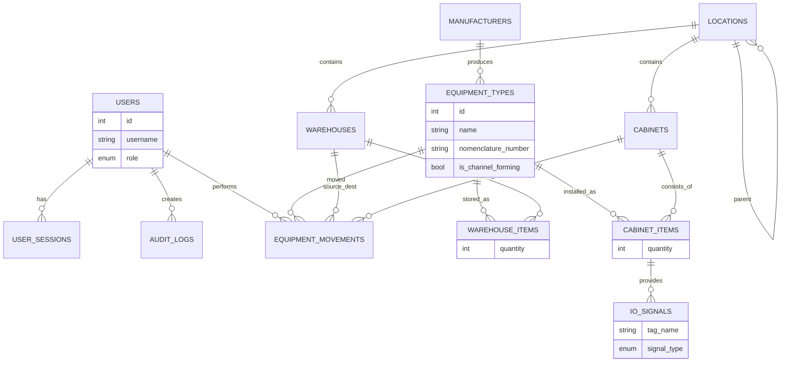

# Architecture (ТЗ / System Design)

Версия документа: 0.1 (19.12.2025)  
Технологический стек: **PostgreSQL 16.3**, **FastAPI (Python 3.12.10)**, **SQLAlchemy 2.x**, **Alembic**, **React (Node 24.12.0, npm 11.6.2)**.  
Среда развёртывания: **локальная сеть (on‑prem)**, несколько одновременных пользователей, HTTPS.

---

## 1. Цели и границы системы

### 1.1. Назначение
Web‑приложение для:
- учёта и хранения оборудования (остатки на складах, движение, списание),
- учёта шкафов автоматизации и их комплектации,
- ведения I/O листов и DCL листов (как минимум I/O сигналы; DCL расширяемо),
- управления справочниками (номенклатура, производители, локации и др.),
- аудита действий пользователей, истории логинов/сессий,
- визуализации агрегированных метрик на дашбордах.

### 1.2. Ключевые сущности (из приложенного описания)
- manufacturers (производители)
- locations (иерархия локаций)
- equipment_types (номенклатура/каталог типов оборудования)
- warehouses (склады)
- cabinets (шкафы)
- warehouse_items (остатки по складам)
- cabinet_items (состав шкафа)
- io_signals (I/O лист / сигналы)

### 1.3. Существенные нефункциональные требования
- Одновременная работа нескольких пользователей (конкурентные изменения, блокировки/версии).
- RBAC: **Администратор / Инженер / Просмотрщик**.
- Аудит: логирование CRUD и логинов/логаутов/таймаутов.
- Security: защита от XSS/CSRF/SQLi, HTTPS, безопасное хранение паролей.
- Надёжность: миграции схемы, резервное копирование, мониторинг.
- Производительность: сервер‑side пагинация, индексы, оптимизация агрегатов для дашбордов.

---

## 2. Архитектура решения

### 2.1. Общая схема
- **Frontend (React SPA)**: роутинг, таблицы (search/filter/sort/pagination), формы CRUD, графики/дашборды.
- **Backend (FastAPI)**: REST API, RBAC, валидация (Pydantic), транзакции, аудит, агрегации.
- **DB (PostgreSQL)**: нормализованная схема + JSONB для расширяемых атрибутов.
- **File storage (опционально)**: хранение вложений (локально на сервере или S3‑совместимое хранилище).

### 2.2. Стандарт API
- JSON over HTTPS.
- Версионирование: `/api/v1/...`
- Пагинация (унифицировано):
  - `page` (>=1), `page_size` (1..200)
  - ответ: `items`, `page`, `page_size`, `total`
- Сортировка:
  - `sort=field` или `sort=-field` (минус = DESC)
- Поиск:
  - `q=...` (full‑text‑подобный поиск по ключевым полям)
- Фильтры:
  - точечные: `field=value`
  - диапазоны: `created_at_from`, `created_at_to`, `updated_at_from`, `updated_at_to`

### 2.3. Конкурентный доступ
- Для изменяемых таблиц: **оптимистическая блокировка** через `row_version` (Integer, auto‑increment) либо `updated_at`.
- На уровне БД: транзакции `READ COMMITTED`, для операций перемещения остатков — транзакции + проверка остатка.

---

## 3. Модель данных (SQLAlchemy Models)

Ниже приведена **полная структура БД** для проекта: базовые таблицы из вашего файла + необходимые системные таблицы (users/roles/audit/sessions/attachments), а также минимальные расширения для согласования с требованиями дашбордов и UI.

> Примечание: Везде, где нужно «мягкое удаление», используется `is_deleted`, `deleted_at`, `deleted_by_id`. Для справочников рекомендуется частичный уникальный индекс `WHERE is_deleted = false`.

### 3.1. Общие mixin-и

```python
# app/db/base.py
from sqlalchemy.orm import DeclarativeBase, Mapped, mapped_column
from sqlalchemy import Boolean, DateTime, Integer, func, ForeignKey

class Base(DeclarativeBase):
    pass

class TimestampMixin:
    created_at: Mapped[DateTime] = mapped_column(DateTime(timezone=True), server_default=func.now(), nullable=False)
    updated_at: Mapped[DateTime] = mapped_column(DateTime(timezone=True), server_default=func.now(), onupdate=func.now(), nullable=False)

class SoftDeleteMixin:
    is_deleted: Mapped[bool] = mapped_column(Boolean, server_default="false", nullable=False)
    deleted_at: Mapped[DateTime | None] = mapped_column(DateTime(timezone=True), nullable=True)
    deleted_by_id: Mapped[int | None] = mapped_column(ForeignKey("users.id"), nullable=True)

class VersionMixin:
    row_version: Mapped[int] = mapped_column(Integer, server_default="1", nullable=False)
```

---

### 3.2. Security / Users

```python
# app/models/security.py
from sqlalchemy import String, Enum, DateTime, func, Index
from sqlalchemy.orm import Mapped, mapped_column
import enum

class UserRole(enum.Enum):
    admin = "admin"
    engineer = "engineer"
    viewer = "viewer"

class User(Base, TimestampMixin, SoftDeleteMixin, VersionMixin):
    __tablename__ = "users"
    id: Mapped[int] = mapped_column(primary_key=True)
    username: Mapped[str] = mapped_column(String(64), unique=True, index=True, nullable=False)
    password_hash: Mapped[str] = mapped_column(String(255), nullable=False)
    role: Mapped[UserRole] = mapped_column(Enum(UserRole, name="user_role"), nullable=False, index=True)
    last_login_at: Mapped[DateTime | None] = mapped_column(DateTime(timezone=True))

Index("ix_users_username_active_unique", User.username, unique=True, postgresql_where=(User.is_deleted == False))
```

```python
# app/models/sessions.py
from sqlalchemy import String, DateTime, ForeignKey
from sqlalchemy.orm import Mapped, mapped_column

class UserSession(Base, TimestampMixin):
    __tablename__ = "user_sessions"
    id: Mapped[int] = mapped_column(primary_key=True)
    user_id: Mapped[int] = mapped_column(ForeignKey("users.id"), index=True, nullable=False)
    session_token_hash: Mapped[str] = mapped_column(String(255), unique=True, index=True, nullable=False)
    started_at: Mapped[DateTime] = mapped_column(DateTime(timezone=True), server_default=func.now(), nullable=False)
    ended_at: Mapped[DateTime | None] = mapped_column(DateTime(timezone=True))
    end_reason: Mapped[str | None] = mapped_column(String(32))  # logout / timeout / revoked
    ip_address: Mapped[str | None] = mapped_column(String(64))
    user_agent: Mapped[str | None] = mapped_column(String(255))
```

---

### 3.3. Core dictionaries and entities (из вашего файла)

```python
# app/models/core.py
from sqlalchemy import String, Integer, Boolean, JSON, ForeignKey, Index
from sqlalchemy.orm import Mapped, mapped_column, relationship

class Manufacturer(Base, TimestampMixin, SoftDeleteMixin, VersionMixin):
    __tablename__ = "manufacturers"
    id: Mapped[int] = mapped_column(primary_key=True)
    name: Mapped[str] = mapped_column(String(100), nullable=False)
    country: Mapped[str] = mapped_column(String(100), nullable=False)

Index("ix_manufacturers_name_active_unique", Manufacturer.name, unique=True,
      postgresql_where=(Manufacturer.is_deleted == False))


class Location(Base, TimestampMixin, SoftDeleteMixin, VersionMixin):
    __tablename__ = "locations"
    id: Mapped[int] = mapped_column(primary_key=True)
    name: Mapped[str] = mapped_column(String(150), nullable=False)
    parent_id: Mapped[int | None] = mapped_column(ForeignKey("locations.id", ondelete="SET NULL"), index=True)
    parent: Mapped["Location | None"] = relationship(remote_side="Location.id", backref="children")


class EquipmentType(Base, TimestampMixin, SoftDeleteMixin, VersionMixin):
    __tablename__ = "equipment_types"
    id: Mapped[int] = mapped_column(primary_key=True)
    name: Mapped[str] = mapped_column(String(200), nullable=False)
    nomenclature_number: Mapped[str] = mapped_column(String(100), nullable=False)
    manufacturer_id: Mapped[int] = mapped_column(ForeignKey("manufacturers.id"), index=True, nullable=False)
    is_channel_forming: Mapped[bool] = mapped_column(Boolean, server_default="false", nullable=False)
    channel_count: Mapped[int] = mapped_column(Integer, server_default="0", nullable=False)
    meta_data: Mapped[dict | None] = mapped_column(JSON)  # JSONB in Postgres

    manufacturer: Mapped[Manufacturer] = relationship()

Index("ix_equipment_types_nomenclature_active_unique", EquipmentType.nomenclature_number, unique=True,
      postgresql_where=(EquipmentType.is_deleted == False))


class Warehouse(Base, TimestampMixin, SoftDeleteMixin, VersionMixin):
    __tablename__ = "warehouses"
    id: Mapped[int] = mapped_column(primary_key=True)
    name: Mapped[str] = mapped_column(String(200), nullable=False)
    location_id: Mapped[int | None] = mapped_column(ForeignKey("locations.id", ondelete="SET NULL"), index=True)
    meta_data: Mapped[dict | None] = mapped_column(JSON)

    location: Mapped[Location | None] = relationship()


class Cabinet(Base, TimestampMixin, SoftDeleteMixin, VersionMixin):
    __tablename__ = "cabinets"
    id: Mapped[int] = mapped_column(primary_key=True)
    name: Mapped[str] = mapped_column(String(200), nullable=False)  # ШУ-12
    location_id: Mapped[int | None] = mapped_column(ForeignKey("locations.id", ondelete="SET NULL"), index=True)
    meta_data: Mapped[dict | None] = mapped_column(JSON)

    location: Mapped[Location | None] = relationship()
```

---

### 3.4. Operational tables (из вашего файла)

```python
# app/models/operations.py
from sqlalchemy import DateTime, Integer, ForeignKey, UniqueConstraint, func
from sqlalchemy.orm import Mapped, mapped_column, relationship

class WarehouseItem(Base, TimestampMixin, SoftDeleteMixin, VersionMixin):
    # Остатки по складу и типу оборудования.
    __tablename__ = "warehouse_items"
    id: Mapped[int] = mapped_column(primary_key=True)
    warehouse_id: Mapped[int] = mapped_column(ForeignKey("warehouses.id"), index=True, nullable=False)
    equipment_type_id: Mapped[int] = mapped_column(ForeignKey("equipment_types.id"), index=True, nullable=False)
    quantity: Mapped[int] = mapped_column(Integer, nullable=False, server_default="0")
    last_updated: Mapped[DateTime] = mapped_column(DateTime(timezone=True), server_default=func.now(), nullable=False)

    warehouse: Mapped["Warehouse"] = relationship()
    equipment_type: Mapped["EquipmentType"] = relationship()

    __table_args__ = (
        UniqueConstraint("warehouse_id", "equipment_type_id", name="uq_warehouse_items_wh_eqtype"),
    )


class CabinetItem(Base, TimestampMixin, SoftDeleteMixin, VersionMixin):
    # Состав шкафа: какая номенклатура в каком шкафу и сколько.
    __tablename__ = "cabinet_items"
    id: Mapped[int] = mapped_column(primary_key=True)
    cabinet_id: Mapped[int] = mapped_column(ForeignKey("cabinets.id"), index=True, nullable=False)
    equipment_type_id: Mapped[int] = mapped_column(ForeignKey("equipment_types.id"), index=True, nullable=False)
    quantity: Mapped[int] = mapped_column(Integer, nullable=False, server_default="0")

    cabinet: Mapped["Cabinet"] = relationship()
    equipment_type: Mapped["EquipmentType"] = relationship()

    __table_args__ = (
        UniqueConstraint("cabinet_id", "equipment_type_id", name="uq_cabinet_items_cb_eqtype"),
    )
```

```python
# app/models/io.py
from sqlalchemy import String, Enum, ForeignKey
from sqlalchemy.orm import Mapped, mapped_column, relationship
import enum

class SignalType(enum.Enum):
    AI = "AI"
    AO = "AO"
    DI = "DI"
    DO = "DO"

class MeasurementType(enum.Enum):
    mA_4_20 = "4-20mA"
    v_0_10 = "0-10V"
    other = "other"

class IOSignal(Base, TimestampMixin, SoftDeleteMixin, VersionMixin):
    __tablename__ = "io_signals"
    id: Mapped[int] = mapped_column(primary_key=True)
    cabinet_component_id: Mapped[int] = mapped_column(ForeignKey("cabinet_items.id"), index=True, nullable=False)

    tag_name: Mapped[str | None] = mapped_column(String(200))
    signal_name: Mapped[str | None] = mapped_column(String(500))
    plc_channel_address: Mapped[str | None] = mapped_column(String(100))

    signal_type: Mapped[SignalType] = mapped_column(Enum(SignalType, name="signal_type"), nullable=False)
    measurement_type: Mapped[MeasurementType] = mapped_column(Enum(MeasurementType, name="measurement_type"), nullable=False)

    terminal_connection: Mapped[str | None] = mapped_column(String(100))
    sensor_range: Mapped[str | None] = mapped_column(String(100))
    engineering_units: Mapped[str | None] = mapped_column(String(50))

    cabinet_component: Mapped["CabinetItem"] = relationship()
```

---

### 3.5. Движение оборудования (добавлено для закрытия требований)

В текущей схеме (warehouse_items/cabinet_items) отсутствует **журнал движений**, из‑за чего:
- сложно восстановить историю (“когда и кем перемещено”),
- сложно корректно реализовать “последние действия с Equipment” на дашборде,
- невозможно безопасно обработать конкурентные списания/перемещения без следа.

Добавляется таблица движений:

```python
# app/models/movements.py
from sqlalchemy import String, Enum, CheckConstraint, ForeignKey, Integer
from sqlalchemy.orm import Mapped, mapped_column
import enum

class MovementType(enum.Enum):
    inbound = "inbound"            # приход на склад
    transfer = "transfer"          # склад -> склад
    to_cabinet = "to_cabinet"      # склад -> шкаф
    from_cabinet = "from_cabinet"  # шкаф -> склад
    writeoff = "writeoff"          # списание
    adjustment = "adjustment"      # инвентаризация/корректировка

class EquipmentMovement(Base, TimestampMixin):
    __tablename__ = "equipment_movements"
    id: Mapped[int] = mapped_column(primary_key=True)
    movement_type: Mapped[MovementType] = mapped_column(Enum(MovementType, name="movement_type"), nullable=False, index=True)

    equipment_type_id: Mapped[int] = mapped_column(ForeignKey("equipment_types.id"), index=True, nullable=False)
    quantity: Mapped[int] = mapped_column(Integer, nullable=False)

    from_warehouse_id: Mapped[int | None] = mapped_column(ForeignKey("warehouses.id"), index=True)
    to_warehouse_id: Mapped[int | None] = mapped_column(ForeignKey("warehouses.id"), index=True)

    from_cabinet_id: Mapped[int | None] = mapped_column(ForeignKey("cabinets.id"), index=True)
    to_cabinet_id: Mapped[int | None] = mapped_column(ForeignKey("cabinets.id"), index=True)

    reference: Mapped[str | None] = mapped_column(String(200))  # накладная/заказ/акт
    comment: Mapped[str | None] = mapped_column(String(1000))

    performed_by_id: Mapped[int] = mapped_column(ForeignKey("users.id"), index=True, nullable=False)

    __table_args__ = (
        CheckConstraint("quantity > 0", name="ck_equipment_movements_qty_positive"),
    )
```

**Правило:** изменения `warehouse_items` и `cabinet_items` производятся только в транзакции вместе с записью в `equipment_movements`.

---

### 3.6. Аудит (логирование действий)

```python
# app/models/audit.py
from sqlalchemy import String, JSON, ForeignKey, Integer
from sqlalchemy.orm import Mapped, mapped_column

class AuditLog(Base, TimestampMixin):
    __tablename__ = "audit_logs"
    id: Mapped[int] = mapped_column(primary_key=True)
    actor_id: Mapped[int] = mapped_column(ForeignKey("users.id"), index=True, nullable=False)
    action: Mapped[str] = mapped_column(String(32), index=True, nullable=False)  # CREATE/UPDATE/DELETE/LOGIN/LOGOUT
    entity: Mapped[str] = mapped_column(String(64), index=True, nullable=False)  # table/model name
    entity_id: Mapped[int | None] = mapped_column(Integer, index=True)
    before: Mapped[dict | None] = mapped_column(JSON)
    after: Mapped[dict | None] = mapped_column(JSON)
    meta: Mapped[dict | None] = mapped_column(JSON)  # ip, ua, request_id etc.
```

---

### 3.7. Вложения (файлы/изображения)

```python
# app/models/attachments.py
from sqlalchemy import String, Integer, ForeignKey
from sqlalchemy.orm import Mapped, mapped_column

class Attachment(Base, TimestampMixin, SoftDeleteMixin):
    __tablename__ = "attachments"
    id: Mapped[int] = mapped_column(primary_key=True)
    entity: Mapped[str] = mapped_column(String(64), index=True, nullable=False)     # e.g. "equipment_types"
    entity_id: Mapped[int] = mapped_column(Integer, index=True, nullable=False)    # target row id
    filename: Mapped[str] = mapped_column(String(255), nullable=False)
    content_type: Mapped[str] = mapped_column(String(100), nullable=False)
    size_bytes: Mapped[int] = mapped_column(Integer, nullable=False)
    storage_path: Mapped[str] = mapped_column(String(500), nullable=False)         # path on server / bucket key
    uploaded_by_id: Mapped[int] = mapped_column(ForeignKey("users.id"), index=True, nullable=False)
```

---

## 4. REST API спецификация (v1)

### 4.1. Auth & Sessions
**POST** `/api/v1/auth/login`  
Request:
```json
{ "username": "user", "password": "secret" }
```
Response:
```json
{ "access_token": "<jwt>", "token_type": "bearer", "user": { "id": 1, "username": "user", "role": "engineer" } }
```

**POST** `/api/v1/auth/logout`  
— завершает текущую сессию (логируется), инвалидирует токен (опционально через denylist).

**GET** `/api/v1/auth/me`  
— возвращает текущего пользователя.

**GET** `/api/v1/sessions` (admin)  
Query: `user_id`, `from`, `to`, `page`, `page_size`  
— список логинов/сессий для дашборда 2.1.5.

Требование: таймаут неактивности 5 минут. Реализация: short‑lived access token + refresh (или sliding expiration), либо server‑side sessions с last_seen.

---

### 4.2. Унифицированные CRUD endpoints
Для всех сущностей (кроме спец‑эндпоинтов) поддерживаются:
- **GET** list (с пагинацией/поиском/фильтрами)
- **GET** by id
- **POST** create
- **PUT** update (полное) или **PATCH** (частичное)
- **DELETE** soft delete (по умолчанию)
- **POST** `/restore` восстановление (для справочников)

Также:
- `include_deleted=true` — показывать удалённые (по умолчанию false)
- `with_relations=true` — отдавать развёрнутые FK (например manufacturer name), либо всегда возвращать dto с joined полями.

---

### 4.3. Dictionaries

#### Manufacturers
- `GET /api/v1/manufacturers`
- `GET /api/v1/manufacturers/{id}`
- `POST /api/v1/manufacturers`
- `PUT /api/v1/manufacturers/{id}`
- `DELETE /api/v1/manufacturers/{id}`
- `POST /api/v1/manufacturers/{id}/restore`

#### Locations
- `GET /api/v1/locations` (плоский список)
- `GET /api/v1/locations/tree` (дерево)
- `POST /api/v1/locations`
- `PUT /api/v1/locations/{id}`
- `DELETE /api/v1/locations/{id}`
- `POST /api/v1/locations/{id}/restore`

Валидации:
- запрет циклов `parent_id` (родитель не может быть потомком),
- при delete: `ondelete=SET NULL` для ссылок, либо запрет удаления если используется (выбирается политикой).

#### Equipment Types
- `GET /api/v1/equipment-types`
- `GET /api/v1/equipment-types/{id}`
- `POST /api/v1/equipment-types`
- `PUT /api/v1/equipment-types/{id}`
- `DELETE /api/v1/equipment-types/{id}`
- `POST /api/v1/equipment-types/{id}/restore`
- `POST /api/v1/equipment-types/{id}/attachments` (multipart)

---

### 4.4. Warehouses & Warehouse items

#### Warehouses
- `GET /api/v1/warehouses`
- `POST /api/v1/warehouses`
- `PUT /api/v1/warehouses/{id}`
- `DELETE /api/v1/warehouses/{id}`

#### Warehouse items (остатки)
- `GET /api/v1/warehouse-items`
  - filters: `warehouse_id`, `equipment_type_id`, `quantity_gt`, `quantity_lt`
- `POST /api/v1/warehouse-items` (создание начального остатка; обычно через movements)
- `PUT /api/v1/warehouse-items/{id}`
- `DELETE /api/v1/warehouse-items/{id}`

Рекомендуемый путь: изменять остатки **только** через endpoints движений.

---

### 4.5. Cabinets & Cabinet items

#### Cabinets
- `GET /api/v1/cabinets`
- `POST /api/v1/cabinets`
- `PUT /api/v1/cabinets/{id}`
- `DELETE /api/v1/cabinets/{id}`

#### Cabinet items
- `GET /api/v1/cabinet-items`
  - filters: `cabinet_id`, `equipment_type_id`
- `POST /api/v1/cabinet-items`
- `PUT /api/v1/cabinet-items/{id}`
- `DELETE /api/v1/cabinet-items/{id}`

---

### 4.6. I/O Signals
- `GET /api/v1/io-signals`
  - filters: `cabinet_id` (через join), `cabinet_component_id`, `signal_type`, `tag_name`
- `POST /api/v1/io-signals`
- `PUT /api/v1/io-signals/{id}`
- `DELETE /api/v1/io-signals/{id}`

Валидации:
- `cabinet_component_id` должен ссылаться на `cabinet_items`, где `equipment_type.is_channel_forming = true` (как указано в вашем файле).

---

### 4.7. Movements (операции прихода/перемещения/списания)
- `GET /api/v1/movements`
  - filters: `movement_type`, `equipment_type_id`, `performed_by_id`, `from_*`, `to_*`, `created_at_from/to`
- `POST /api/v1/movements`
Request (пример transfer склад→шкаф):
```json
{
  "movement_type": "to_cabinet",
  "equipment_type_id": 10,
  "quantity": 2,
  "from_warehouse_id": 1,
  "to_cabinet_id": 7,
  "reference": "Накладная 123",
  "comment": "Монтаж ШУ-12"
}
```
Response: movement + пересчитанные остатки.

---

### 4.8. Audit
- `GET /api/v1/audit-logs` (admin/engineer)
  - filters: `actor_id`, `entity`, `action`, `created_at_from/to`, `q`
- `GET /api/v1/audit-logs/{id}`

---

### 4.9. Dashboards (Overview)

**GET** `/api/v1/dashboard/equipment-by-type`  
Возвращает распределение по типам (donut):
```json
[{ "equipment_type_id": 10, "name": "ПЛК", "quantity": 120, "percent": 0.10 }]
```

**GET** `/api/v1/dashboard/equipment-by-warehouse`  
Источник: сумма `warehouse_items.quantity` по складам:
```json
[{ "warehouse_id": 1, "warehouse": "Склад 1", "quantity": 134 }]
```

**GET** `/api/v1/dashboard/metrics`  
Возвращает 2.1.3:
```json
{
  "cabinets_total": 345,
  "plc_total": 234,
  "relay_total": 110,
  "io_stations_total": 210,
  "other_channel_forming_total": 54,
  "signals_total": 7448
}
```
Примечание: `signals_total` = count(io_signals) с учётом is_deleted=false.

**GET** `/api/v1/dashboard/recent-equipment-actions`  
Берётся из `equipment_movements` + `users` (2.1.4).

**GET** `/api/v1/dashboard/recent-logins`  
Берётся из `user_sessions` (2.1.5).

**GET** `/api/v1/dashboard/accounting-status`  
Если нужен donut “Учтено/Не учтено”, требуется поле статуса на уровне **движений** или **инвентаризационных записей**.  
Рекомендуемая реализация: добавить в `equipment_movements.meta` признак `accounting_status`, либо отдельную таблицу `inventory_batches`.

**GET** `/api/v1/dashboard/cost-by-type`  
Требует цены. В текущей схеме цена предполагается внутри `equipment_types.meta_data` (например `{"price_rub": 10000}`) либо отдельное поле `unit_price`.  
Ответ:
```json
[{ "equipment_type_id": 10, "name": "ПЛК", "total_cost_rub": 4300000 }]
```

---

## 5. Требования к UI/UX (расширено)

### 5.1. Общие принципы
- Минималистичный современный интерфейс (нейтральные цвета, простая типографика, 8‑pt grid).
- Адаптивность: desktop + tablet.
- A11y: контраст, фокус‑стили, навигация с клавиатуры, aria‑лейблы.
- Единый компонент таблиц и форм во всех разделах.

### 5.2. Таблицы
Для каждой таблицы:
- server‑side **pagination**, **sorting**, **filtering**, **search**.
- фиксированная панель действий:
  - “+” добавить
  - “⋮” действия: редактировать/копировать/вставить/удалить/восстановить (если удалено)
- inline‑отображение статуса удалено/активно, переключатель “показывать удалённые”.
- экспорт (добавлено): **CSV/XLSX** для инженеров/админов.
- массовые операции (добавлено): multi‑select и bulk delete/restore (admin/engineer).

### 5.3. Формы Create/Update
- Pydantic‑валидация + отображение ошибок рядом с полями.
- обязательные поля помечены.
- Upload вложений (если разрешено для сущности).
- tooltips для сложных полей.
- подтверждение удалений.
- предупреждение при уходе со страницы с несохранёнными изменениями (особенно для справочников).

### 5.4. Overview (дашборды)
- donut charts + bar charts (по складам) + табличные виджеты.
- период/фильтры: “все склады / конкретный склад”, “все типы / тип”.
- авто‑обновление по кнопке “Обновить” (не continuous, чтобы не грузить сеть).

### 5.5. Роли и доступы в UI
- Viewer: read‑only, скрывать кнопки действий.
- Engineer: полный CRUD по бизнес‑таблицам и справочникам (кроме пользователей).
- Admin: всё + управление пользователями/ролями.

---

## 6. Требования к Backend (расширено)

### 6.1. Безопасность
- Пароли: bcrypt/argon2, политика сложности.
- JWT (access/refresh) или server‑side sessions.
- CORS только для доверенных origin в локальной сети.
- CSRF: если cookies‑auth — включить CSRF; если Bearer JWT — CSRF не нужен, но нужно защищать XSS.
- Rate limiting для login.
- Audit trail обязателен для CREATE/UPDATE/DELETE + LOGIN/LOGOUT.

### 6.2. Валидации и бизнес‑правила
- `warehouse_items.quantity >= 0`, `cabinet_items.quantity >= 0`.
- Поддерживаются **два независимых сценария наполнения шкафов**:
  1. **Из склада** — через движения оборудования:
     - движение “to_cabinet” уменьшает остаток на складе и увеличивает состав шкафа;
     - запрещено выполнение операции при недостаточном остатке на складе.
  2. **Непосредственно из номенклатуры (без склада)**:
     - шкаф может быть наполнен оборудованием напрямую из `equipment_types`;
     - при таком сценарии `warehouse_items` **не затрагиваются**;
     - операция фиксируется как отдельный тип движения (см. ниже).
- Запрет списания (write-off) при недостаточном остатке применяется **только** к операциям,
  которые используют склад или шкаф как источник.
- Все изменения состава шкафов и складов должны выполняться в транзакции и логироваться.

#### Дополнение: тип движения `direct_to_cabinet`
Для поддержки наполнения шкафов без участия склада вводится дополнительный тип движения:
- `direct_to_cabinet` — добавление оборудования в шкаф напрямую из номенклатуры.

Бизнес-правила для `direct_to_cabinet`:
- обязательно указаны: `equipment_type_id`, `cabinet_id`, `quantity`;
- поля `from_warehouse_id`, `to_warehouse_id`, `from_cabinet_id` — `NULL`;
- операция **не изменяет** `warehouse_items`;
- операция увеличивает `cabinet_items.quantity`;
- операция отображается в журнале движений и в аудит-логах;
- используется для сценариев:
  - шкаф поставлен уже укомплектованным;
  - первичное заведение шкафа в систему;
  - восстановление данных по проектной документации.
- `io_signals.cabinet_component_id` — только для каналообразующего оборудования.
- Для locations: защита от циклов.

### 6.3. Наблюдаемость и эксплуатация (добавлено)
- Structured logging (JSON logs).
- request_id в каждом запросе.
- Health endpoints: `/api/v1/health` (db connectivity).
- Метрики (опционально): Prometheus.

---

## 7. Требования к Frontend (расширено)

- React + TypeScript (рекомендуется), React Router, состояние: TanStack Query.
- Таблицы: TanStack Table / AG Grid community (по выбору).
- UI kit: MUI / AntD / shadcn/ui (по выбору), единый дизайн‑токены.
- Графики: Recharts / ECharts.
- Авторизация: хранение токена безопасно (предпочтительно httpOnly cookie при возможности).
- Обработка ошибок: toast + error boundary.
- Локализация: RU (подготовить i18n‑слой, даже если одна локаль).

---

## 8. Проверка коллизий и предложения исправлений

### 8.1. Коллизия: “Qty в таблице Warehouses”
В требованиях к дашборду 2.1.2 указано: “Данные берутся из суммы Qty таблицы Warehouses”.  
В схеме `warehouses` поля `qty` нет; остатки находятся в `warehouse_items.quantity`.

**Исправление:**
- Источник данных дашборда 2.1.2: `SUM(warehouse_items.quantity) GROUP BY warehouse_id`.  
- Не добавлять `qty` в warehouses (иначе будет денормализация и риск несогласованности).

### 8.2. Коллизия: “Equipment” как отдельная таблица
В UI описана вкладка “Equipment” как основная таблица приходов/учёта “по типам, наименованиям, идентификаторам и количеству”.
В текущей схеме есть:
- `equipment_types` (каталог типов),
- `warehouse_items` (агрегированный остаток),
но **нет** сущности “партия/приход/операция”, по которой можно показать “кто и когда добавил”.

**Исправление (рекомендуемое):**
- Использовать `equipment_movements` как “журнал Equipment”.  
- Вкладка “Equipment” отображает список движений (inbound/transfer/…) с фильтрами и действиями.  
- Остатки показывать отдельно (Warehouse items).

### 8.3. Коллизия: “Учтено/Не учтено” как идентификатор
Требуется donut по “Учтено/Не учтено”. В схеме нет соответствующего атрибута.

**Исправление (варианты):**
1) Добавить `accounting_status` в `equipment_movements.meta` (минимально инвазивно).  
2) Добавить таблицу `inventory_batches` (если нужно вести инвентаризации/партии).

### 8.4. Коллизия: цена для дашборда стоимости
Дашборд 2.1.7 требует “общую стоимость по типам”. В схеме цена не определена.

**Исправление:**
- Добавить `unit_price_rub` (Numeric) в `equipment_types` **или** хранить в `meta_data.price_rub`.  
- Для точности расчётов предпочтительнее явное поле `unit_price_rub NUMERIC(14,2)` + валюта.

### 8.5. Soft delete + уникальность
Справочники должны поддерживать “удалена, но хранится” и при этом иметь уникальные поля (`manufacturer.name`, `equipment_types.nomenclature_number`).
Если использовать `unique=True` без учёта soft delete — нельзя будет создать запись с тем же именем после удаления.

**Исправление:**
- Убрать жёсткий unique constraint и заменить на **partial unique index** `WHERE is_deleted = false` (как в моделях выше).

### 8.6. Конкурентные изменения остатков
При одновременных изменениях остатков (двое инженеров) возможны race conditions.

**Исправление:**
- Все операции движения делать в транзакции.
- Для строк `warehouse_items` при изменении использовать `SELECT ... FOR UPDATE` либо optimistic lock (`row_version`) + retry.

---

## 9. Минимальный план разделов меню (предложение)

- Overview (дашборды)
- Dictionaries
  - Manufacturers
  - Locations
  - Equipment Types
- Warehouses
  - Warehouses
  - Warehouse items (остатки)
  - Movements (журнал)
- Cabinets
  - Cabinets
  - Cabinet items
  - IO Signals (I/O list)
- Admin (только admin)
  - Users
  - Sessions
  - Audit logs

---

## 10. Definition of Done (DoD)
- RBAC реализован, UI скрывает запрещённые действия, backend проверяет права на каждом endpoint.
- Все CRUD работают, фильтрация/поиск/пагинация на сервере.
- Soft delete + restore для справочников.
- Аудит: CREATE/UPDATE/DELETE + LOGIN/LOGOUT, доступен для просмотра.
- Дашборды Overview соответствуют требованиям, считаются быстро (индексы, агрегации).
- Миграции Alembic, базовый seed справочников.
- Документация OpenAPI доступна `/docs`.


---

## 11. Дополнительные требования (расширение ТЗ)

### 11.1. Мультиязычность (i18n)
- Приложение должно поддерживать **как минимум два языка интерфейса**:  
  - Русский (RU) — язык по умолчанию  
  - Английский (EN)
- Переключение языка должно быть доступно **во время работы приложения**, без перезагрузки страницы.
- Выбранный язык должен сохраняться:
  - в настройках пользователя (в БД),
  - и/или в localStorage (fallback).
- Все текстовые ресурсы (UI, ошибки, tooltips, системные сообщения) должны быть вынесены в i18n‑слой.
- Backend должен поддерживать локализацию сообщений валидации и ошибок (Accept-Language).

### 11.2. Темы оформления (Light / Dark mode)
- Приложение должно поддерживать **светлую и тёмную тему**.
- Переключение темы должно происходить **динамически**, без перезагрузки.
- Выбор темы должен сохраняться:
  - в профиле пользователя,
  - либо в localStorage.
- Дизайн должен учитывать:
  - достаточную контрастность (WCAG AA),
  - корректное отображение графиков и таблиц в обеих темах.
- Компоненты UI должны использовать дизайн‑токены (colors, spacing), а не “жёстко заданные” цвета.

### 11.3. Навигация и меню
- Меню приложения должно быть:
  - минималистичным,
  - вертикальным,
  - с возможностью сворачивания (collapsed mode).
- Референс по логике и структуре: **chat.openai.com**:
  - слева — основная навигация,
  - активный пункт явно подсвечен,
  - поддержка иконок + текст.
- Меню должно поддерживать:
  - вложенные пункты (Warehouses → Items → Movements),
  - скрытие пунктов, недоступных по роли.
- Верхняя панель:
  - текущий пользователь (username),
  - роль,
  - кнопки: Language, Theme, Logout.

### 11.4. Пользовательские настройки
- Добавить раздел **User Settings**:
  - язык интерфейса,
  - тема оформления,
  - предпочтительный размер таблиц (compact / default),
  - количество строк на страницу по умолчанию.
- Настройки должны храниться в БД и применяться при логине.

### 11.5. Уведомления и обратная связь
- Все системные события должны сопровождаться уведомлениями:
  - успешное сохранение,
  - ошибка валидации,
  - ошибка сервера,
  - предупреждения (например, недостаточно прав).
- Формат уведомлений:
  - toast/snackbar,
  - авто‑закрытие + возможность ручного закрытия.
- Для критических действий (удаление, списание) — modal confirmation.

### 11.6. Обработка ошибок
- Глобальный Error Boundary на frontend.
- Страница 404 (not found) и 403 (forbidden).
- Читаемые сообщения об ошибках для пользователя.
- Детальная ошибка логируется только на backend.

### 11.7. Экспорт и импорт данных
- Экспорт таблиц:
  - CSV,
  - XLSX.
- Импорт (опционально, role >= Engineer):
  - CSV/XLSX для справочников и оборудования,
  - предварительный preview данных перед сохранением,
  - отчёт об ошибках импорта.

### 11.8. История изменений (audit UI)
- Для сущностей:
  - Equipment movements,
  - Warehouse items,
  - Cabinet items,
  - Dictionaries
- В UI должна быть доступна вкладка **History**:
  - кто изменил,
  - когда,
  - какие поля (diff).
- Источник данных — таблица `audit_logs`.

### 11.9. Производительность и ограничения
- Время ответа API:
  - CRUD операции ≤ 300 мс (p95),
  - дашборды ≤ 1 сек.
- Максимальные размеры:
  - файл вложения ≤ 20 МБ,
  - количество строк в таблице без фильтра — не более 100 000 (обязательная пагинация).
- Все тяжёлые агрегации должны выполняться на стороне БД.

### 11.10. Резервное копирование и восстановление
- Регулярное резервное копирование PostgreSQL:
  - daily full backup,
  - хранение минимум 7 дней.
- Документированная процедура восстановления.
- Возможность восстановления данных без остановки frontend.

### 11.11. Развёртывание и окружения
- Минимум два окружения:
  - development,
  - production (on‑prem).
- Конфигурация через переменные окружения.
- Backend запускается через ASGI server (uvicorn/gunicorn).
- Frontend собирается в static bundle и отдаётся через nginx.

### 11.12. Тестирование
- Backend:
  - unit tests (services, validators),
  - integration tests (API + DB).
- Frontend:
  - unit tests для компонентов,
  - smoke tests для основных сценариев.
- Минимальное покрытие: 60% (целевое — 80%).

### 11.13. Документация
- README:
  - запуск проекта,
  - переменные окружения,
  - миграции,
  - сидирование данных.
- OpenAPI (Swagger) — актуален и используется как контракт.
- Диаграмма БД (ER‑diagram) как часть документации.

### 11.14. Масштабируемость и будущее развитие
- Возможность:
  - добавления новых типов дашбордов,
  - расширения DCL‑листов,
  - подключения внешних систем (ERP, MES) через API.
- Архитектура должна быть готова к:
  - выносу frontend/backend на разные хосты,
  - росту количества пользователей без переписывания кода.

---


---

## 12. ТЗ в формате для передачи подрядчику (Scope & Acceptance Criteria)

### 12.1. Scope проекта
Подрядчик обязан разработать web-приложение для учёта оборудования автоматизации со следующим объёмом работ:

**Включено в scope:**
- Backend (FastAPI):
  - проектирование и реализация REST API;
  - реализация RBAC (Admin / Engineer / Viewer);
  - реализация CRUD для всех сущностей;
  - аудит действий пользователей;
  - дашборды и агрегаты;
  - безопасность (auth, permissions, validations).
- Frontend (React):
  - SPA с роутингом;
  - таблицы с фильтрацией/поиском/пагинацией;
  - формы CRUD;
  - дашборды и графики;
  - мультиязычность и темы;
  - role-based UI.
- Database:
  - PostgreSQL schema;
  - Alembic migrations;
  - seed-данные.
- Документация:
  - OpenAPI;
  - README;
  - ER-diagram.

**Не входит в scope (по умолчанию):**
- мобильные приложения;
- облачное развёртывание;
- интеграции с внешними ERP/MES (если не оговорено отдельно).

---

### 12.2. Acceptance Criteria (общие)
Функциональность считается принятой, если:
- все endpoints доступны и документированы в Swagger;
- роли корректно ограничивают доступ;
- CRUD операции работают и логируются;
- soft delete и restore функционируют;
- дашборды отображают корректные данные;
- приложение стабильно работает минимум с 10 одновременными пользователями;
- отсутствуют критические уязвимости (SQLi/XSS/CSRF);
- frontend не содержит console errors.

---

## 13. Checklist реализации по этапам

### 13.1. MVP (базовая рабочая версия)
**Цель:** получить минимально рабочую систему учёта.

Backend:
- [ ] Auth (login/logout, роли)
- [ ] Users, Sessions
- [ ] Manufacturers, Locations
- [ ] Equipment Types
- [ ] Warehouses, Warehouse Items
- [ ] Cabinets, Cabinet Items
- [ ] Movements (inbound, transfer)
- [ ] Audit logging
- [ ] Alembic migrations

Frontend:
- [ ] Login page
- [ ] Layout + меню
- [ ] Таблицы (CRUD) без расширенной кастомизации
- [ ] Role-based UI
- [ ] Базовые формы

DB:
- [ ] PostgreSQL schema
- [ ] Индексы
- [ ] Seed-данные

---

### 13.2. v1 (функционально завершённая версия)
**Цель:** полноценное использование инженерами.

Backend:
- [ ] I/O Signals
- [ ] Write-off / adjustment movements
- [ ] Dashboard endpoints
- [ ] Export CSV/XLSX
- [ ] Optimistic locking
- [ ] Backup scripts

Frontend:
- [ ] Overview dashboards
- [ ] Фильтры, поиск, пагинация
- [ ] Dark / Light theme
- [ ] RU / EN
- [ ] Notifications
- [ ] History (audit UI)

UX:
- [ ] Tooltips
- [ ] Confirmation dialogs
- [ ] Error pages (403/404)

---

### 13.3. v2 (расширение и оптимизация)
**Цель:** масштабируемость и удобство.

- [ ] Импорт CSV/XLSX
- [ ] Массовые операции
- [ ] User settings
- [ ] Advanced dashboards
- [ ] Performance tuning
- [ ] Metrics / monitoring
- [ ] Подготовка к интеграциям (public API)

---

## 14. ER-diagram (Mermaid)



---

## 15. Финальный критерий приёмки проекта
Проект считается завершённым, если:
- все пункты MVP + v1 реализованы;
- система стабильно работает в локальной сети;
- документация актуальна;
- заказчик может развернуть систему самостоятельно по README;
- архитектура допускает дальнейшее расширение без рефакторинга ядра.


---

## 16. Production-ready структура репозитория (FastAPI + React)

### 16.1. Монорепозиторий (рекомендуется)
```
project-root/
  backend/
    app/
      __init__.py
      main.py
      api/
        __init__.py
        deps.py                 # зависимости (DB session, current_user, RBAC)
        router.py               # корневой router v1
        v1/
          __init__.py
          auth.py
          users.py
          manufacturers.py
          locations.py
          equipment_types.py
          warehouses.py
          warehouse_items.py
          cabinets.py
          cabinet_items.py
          io_signals.py
          movements.py
          audit_logs.py
          dashboard.py
      core/
        __init__.py
        config.py               # pydantic-settings
        security.py             # password hashing, JWT/session helpers
        logging.py              # structured logging, request_id
      db/
        __init__.py
        base.py                 # Base + mixins
        session.py              # engine, sessionmaker
      models/
        __init__.py
        security.py
        sessions.py
        core.py
        operations.py
        io.py
        movements.py
        audit.py
        attachments.py
      schemas/                  # Pydantic DTO contracts
        __init__.py
        common.py
        auth.py
        users.py
        manufacturers.py
        locations.py
        equipment_types.py
        warehouses.py
        warehouse_items.py
        cabinets.py
        cabinet_items.py
        io_signals.py
        movements.py
        audit_logs.py
        dashboard.py
      services/                 # бизнес-логика (use-cases)
        __init__.py
        auth_service.py
        movement_service.py     # транзакции движения и пересчёт остатков
        dashboard_service.py
        audit_service.py
      repositories/             # доступ к данным (query building)
        __init__.py
        base.py
        manufacturers.py
        locations.py
        equipment_types.py
        warehouses.py
        warehouse_items.py
        cabinets.py
        cabinet_items.py
        io_signals.py
        movements.py
        users.py
      utils/
        __init__.py
        pagination.py
        filters.py
        sorting.py
        time.py
      tests/
        __init__.py
        conftest.py
        test_auth.py
        test_movements.py
        test_permissions.py
    alembic/
      env.py
      script.py.mako
      versions/
        0001_initial.py
        0002_indexes.py
    scripts/
      seed.py                   # заполнение справочников/пользователей
      backup_db.ps1
      backup_db.sh
    pyproject.toml
    requirements.txt
    README.md

  frontend/
    src/
      app/
        App.tsx
        routes.tsx
        providers/
          AuthProvider.tsx
          I18nProvider.tsx
          ThemeProvider.tsx
          QueryProvider.tsx
      api/
        client.ts               # fetch/axios wrapper, token handling
        contracts.ts            # типы DTO (генерация из OpenAPI опционально)
        endpoints/
          auth.ts
          manufacturers.ts
          locations.ts
          equipmentTypes.ts
          warehouses.ts
          warehouseItems.ts
          cabinets.ts
          cabinetItems.ts
          ioSignals.ts
          movements.ts
          auditLogs.ts
          dashboard.ts
      components/
        layout/
          Sidebar.tsx
          Topbar.tsx
          PageShell.tsx
        tables/
          DataTable.tsx         # единый компонент таблиц (pagination/sort/filter)
          TableToolbar.tsx
        forms/
          FormModal.tsx
          FileUpload.tsx
        common/
          ConfirmDialog.tsx
          Toast.tsx
          ErrorBoundary.tsx
      features/
        overview/
          OverviewPage.tsx
          widgets/
            DonutWidget.tsx
            MetricsWidget.tsx
            RecentActionsWidget.tsx
        dictionaries/
          DictionariesPage.tsx
          ManufacturersPage.tsx
          LocationsPage.tsx
          EquipmentTypesPage.tsx
        warehouses/
          WarehousesPage.tsx
          WarehouseItemsPage.tsx
          MovementsPage.tsx
        cabinets/
          CabinetsPage.tsx
          CabinetItemsPage.tsx
          IoSignalsPage.tsx
        admin/
          UsersPage.tsx
          SessionsPage.tsx
          AuditLogsPage.tsx
        settings/
          UserSettingsPage.tsx
      i18n/
        index.ts
        ru.json
        en.json
      theme/
        tokens.ts
        index.ts
      styles/
        globals.css
      main.tsx
    public/
    package.json
    tsconfig.json
    vite.config.ts
    README.md

  docker/                       # опционально для dev
    docker-compose.yml
    nginx.conf

  README.md
```

### 16.2. Принципы модульности
- **api/**: только HTTP слой (валидация входа/выхода, зависимости, RBAC guards).
- **services/**: бизнес-логика, транзакции, расчёты, агрегаты.
- **repositories/**: запросы к БД, построение фильтров/поиска/сортировки.
- **schemas/**: DTO/контракты (Pydantic) — единый источник истины для API.
- **models/**: ORM сущности (SQLAlchemy).
- **frontend/features/**: feature-first структура; общие компоненты в components/.

---

## 17. Alembic migrations + seed (пример)

### 17.1. Alembic: env.py (ключевые моменты)
- Использовать `SQLALCHEMY_DATABASE_URL` из env.
- Подключить `Base.metadata` из `app.db.base`.
- Включить autogenerate и naming convention.

Фрагмент (идея):
```python
# backend/alembic/env.py (фрагмент)
from app.db.session import engine
from app.db.base import Base
from app.models import security, core, operations, io, movements, audit, attachments  # noqa: F401

target_metadata = Base.metadata
```

### 17.2. Migration 0001_initial.py (примерный каркас)
> Пример ниже намеренно сокращён. В реальном проекте Alembic autogenerate создаст полный DDL.

```python
# backend/alembic/versions/0001_initial.py
from alembic import op
import sqlalchemy as sa

revision = "0001_initial"
down_revision = None

def upgrade():
    op.create_table(
        "users",
        sa.Column("id", sa.Integer, primary_key=True),
        sa.Column("username", sa.String(length=64), nullable=False),
        sa.Column("password_hash", sa.String(length=255), nullable=False),
        sa.Column("role", sa.Enum("admin","engineer","viewer", name="user_role"), nullable=False),
        sa.Column("is_deleted", sa.Boolean(), server_default=sa.text("false"), nullable=False),
        sa.Column("created_at", sa.DateTime(timezone=True), server_default=sa.text("now()"), nullable=False),
        sa.Column("updated_at", sa.DateTime(timezone=True), server_default=sa.text("now()"), nullable=False),
    )
    op.create_index("ix_users_username", "users", ["username"], unique=True)

    op.create_table(
        "manufacturers",
        sa.Column("id", sa.Integer, primary_key=True),
        sa.Column("name", sa.String(length=100), nullable=False),
        sa.Column("country", sa.String(length=100), nullable=False),
        sa.Column("is_deleted", sa.Boolean(), server_default=sa.text("false"), nullable=False),
        sa.Column("created_at", sa.DateTime(timezone=True), server_default=sa.text("now()"), nullable=False),
        sa.Column("updated_at", sa.DateTime(timezone=True), server_default=sa.text("now()"), nullable=False),
    )
    # ... остальные таблицы ...

def downgrade():
    op.drop_table("manufacturers")
    op.drop_table("users")
```

### 17.3. Seed-скрипт (scripts/seed.py)
Требования к seed:
- создаёт администратора (если отсутствует);
- добавляет минимальные справочники (manufacturers, equipment_types пример, warehouses пример);
- запускается идемпотентно.

```python
# backend/scripts/seed.py
import os
from sqlalchemy import select
from app.db.session import SessionLocal
from app.core.security import hash_password
from app.models.security import User, UserRole
from app.models.core import Manufacturer, EquipmentType, Warehouse

def run():
    db = SessionLocal()
    try:
        # Admin user
        admin_username = os.getenv("SEED_ADMIN_USERNAME", "admin")
        admin_password = os.getenv("SEED_ADMIN_PASSWORD", "admin123")
        admin = db.scalar(select(User).where(User.username == admin_username))
        if not admin:
            admin = User(username=admin_username, password_hash=hash_password(admin_password), role=UserRole.admin)
            db.add(admin)

        # Manufacturers
        siemens = db.scalar(select(Manufacturer).where(Manufacturer.name == "Siemens", Manufacturer.is_deleted == False))
        if not siemens:
            siemens = Manufacturer(name="Siemens", country="Germany")
            db.add(siemens)

        # Warehouses
        wh = db.scalar(select(Warehouse).where(Warehouse.name == "Склад 1", Warehouse.is_deleted == False))
        if not wh:
            wh = Warehouse(name="Склад 1")
            db.add(wh)

        # Equipment type example (with price)
        et = db.scalar(select(EquipmentType).where(EquipmentType.nomenclature_number == "PLC-001", EquipmentType.is_deleted == False))
        if not et:
            et = EquipmentType(
                name="ПЛК базовый",
                nomenclature_number="PLC-001",
                manufacturer=siemens,
                is_channel_forming=True,
                channel_count=16,
                meta_data={"unit_price_rub": 100000}
            )
            db.add(et)

        db.commit()
        print("Seed completed.")
    finally:
        db.close()

if __name__ == "__main__":
    run()
```

---

## 18. User Stories + Acceptance Criteria по ролям

### 18.1. Общие определения
- “Могу” = доступно по UI и разрешено backend-ом (RBAC enforced).
- “Просмотрщик” никогда не видит кнопки действий и не может выполнять write-endpoints.

### 18.2. Admin (Администратор)

**US-A1: Управление пользователями**
- Как Admin, я хочу создавать пользователей и назначать роли, чтобы управлять доступом.
**AC:**
- Admin видит меню Admin → Users.
- Admin может: создать пользователя, сбросить пароль, изменить роль, деактивировать (soft delete).
- Пароль в БД не хранится в открытом виде; используется hash.
- Все действия пишутся в `audit_logs` (action=CREATE/UPDATE/DELETE, entity=users).

**US-A2: Просмотр сессий и логинов**
- Как Admin, я хочу видеть историю логинов, чтобы контролировать доступ.
**AC:**
- Admin видит Admin → Sessions.
- Список фильтруется по user/date.
- Видны started_at, ended_at, end_reason.

**US-A3: Аудит действий**
- Как Admin, я хочу просматривать действия всех пользователей.
**AC:**
- Admin видит Admin → Audit Logs.
- Есть поиск, фильтры по actor/entity/action/датам.
- Запись содержит before/after (если применимо).

### 18.3. Engineer (Инженер)

**US-E1: Управление справочниками**
- Как Engineer, я хочу создавать/редактировать/удалять записи справочников, чтобы поддерживать актуальные данные.
**AC:**
- Engineer видит Dictionaries и все CRUD-кнопки.
- Удаление — soft delete. Есть переключатель “показывать удалённые”.
- Есть restore.
- Уникальность справочников соблюдается для active записей (partial unique index).

**US-E2: Движение оборудования**
- Как Engineer, я хочу оформлять приход/перемещение/списание, чтобы остатки были корректны.
**AC:**
- Любая операция движения создаёт запись в `equipment_movements`.
- Остатки в `warehouse_items`/`cabinet_items` корректируются в одной транзакции.
- Нельзя списать больше остатка.
- Конкурентные операции не приводят к отрицательным остаткам.

**US-E3: Ведение I/O сигналов**
- Как Engineer, я хочу добавлять/редактировать сигналы, чтобы поддерживать I/O лист.
**AC:**
- Сигнал можно привязать только к `cabinet_items`, где equipment_type.is_channel_forming=true.
- Поддерживаются фильтры по шкафу и типу сигнала.
- CRUD логируется.

### 18.4. Viewer (Просмотрщик)

**US-V1: Просмотр данных без изменения**
- Как Viewer, я хочу просматривать данные и дашборды, не рискуя их изменить.
**AC:**
- Viewer видит все вкладки (кроме Admin).
- Отсутствуют кнопки создания/редактирования/удаления.
- Backend отклоняет любые POST/PUT/PATCH/DELETE (403).
- Viewer может использовать фильтры/поиск/пагинацию.

---

## 19. API contracts (DTO / Pydantic schemas) для ключевых endpoints

### 19.1. Общие схемы
```python
# app/schemas/common.py
from pydantic import BaseModel, Field
from typing import Generic, TypeVar, List, Optional
from datetime import datetime

T = TypeVar("T")

class Pagination(BaseModel, Generic[T]):
    items: List[T]
    page: int = Field(ge=1)
    page_size: int = Field(ge=1, le=200)
    total: int = Field(ge=0)

class EntityBase(BaseModel):
    id: int
    created_at: datetime
    updated_at: datetime

class SoftDeleteFields(BaseModel):
    is_deleted: bool
    deleted_at: Optional[datetime] = None
```

### 19.2. Auth
```python
# app/schemas/auth.py
from pydantic import BaseModel
from .users import UserOut

class LoginIn(BaseModel):
    username: str
    password: str

class TokenOut(BaseModel):
    access_token: str
    token_type: str = "bearer"
    user: UserOut
```

### 19.3. Users
```python
# app/schemas/users.py
from pydantic import BaseModel, Field
from enum import Enum
from .common import EntityBase, SoftDeleteFields

class UserRole(str, Enum):
    admin = "admin"
    engineer = "engineer"
    viewer = "viewer"

class UserOut(EntityBase, SoftDeleteFields):
    username: str
    role: UserRole

class UserCreate(BaseModel):
    username: str = Field(min_length=3, max_length=64)
    password: str = Field(min_length=8, max_length=128)
    role: UserRole

class UserUpdate(BaseModel):
    password: str | None = Field(default=None, min_length=8, max_length=128)
    role: UserRole | None = None
    is_deleted: bool | None = None
```

### 19.4. Dictionaries: Manufacturers / Equipment Types
```python
# app/schemas/manufacturers.py
from pydantic import BaseModel, Field
from .common import EntityBase, SoftDeleteFields

class ManufacturerOut(EntityBase, SoftDeleteFields):
    name: str
    country: str

class ManufacturerCreate(BaseModel):
    name: str = Field(min_length=1, max_length=100)
    country: str = Field(min_length=1, max_length=100)

class ManufacturerUpdate(BaseModel):
    name: str | None = Field(default=None, min_length=1, max_length=100)
    country: str | None = Field(default=None, min_length=1, max_length=100)
```

```python
# app/schemas/equipment_types.py
from pydantic import BaseModel, Field
from typing import Optional, Dict, Any
from .common import EntityBase, SoftDeleteFields

class EquipmentTypeOut(EntityBase, SoftDeleteFields):
    name: str
    nomenclature_number: str
    manufacturer_id: int
    is_channel_forming: bool
    channel_count: int
    meta_data: Optional[Dict[str, Any]] = None

class EquipmentTypeCreate(BaseModel):
    name: str = Field(min_length=1, max_length=200)
    nomenclature_number: str = Field(min_length=1, max_length=100)
    manufacturer_id: int
    is_channel_forming: bool = False
    channel_count: int = Field(default=0, ge=0)
    meta_data: Optional[Dict[str, Any]] = None

class EquipmentTypeUpdate(BaseModel):
    name: str | None = Field(default=None, min_length=1, max_length=200)
    manufacturer_id: int | None = None
    is_channel_forming: bool | None = None
    channel_count: int | None = Field(default=None, ge=0)
    meta_data: Optional[Dict[str, Any]] = None
```

### 19.5. Movements (ключевой бизнес-эндпоинт)
```python
# app/schemas/movements.py
from pydantic import BaseModel, Field, model_validator
from enum import Enum
from typing import Optional
from .common import EntityBase

class MovementType(str, Enum):
    inbound = "inbound"
    transfer = "transfer"
    to_cabinet = "to_cabinet"
    from_cabinet = "from_cabinet"
    direct_to_cabinet = "direct_to_cabinet"
    writeoff = "writeoff"
    adjustment = "adjustment"

class MovementCreate(BaseModel):
    movement_type: MovementType
    equipment_type_id: int
    quantity: int = Field(ge=1)

    from_warehouse_id: Optional[int] = None
    to_warehouse_id: Optional[int] = None
    from_cabinet_id: Optional[int] = None
    to_cabinet_id: Optional[int] = None

    reference: Optional[str] = Field(default=None, max_length=200)
    comment: Optional[str] = Field(default=None, max_length=1000)

    @model_validator(mode="after")
    def validate_targets(self):
        mt = self.movement_type
        if mt == MovementType.inbound:
            if not self.to_warehouse_id:
                raise ValueError("to_warehouse_id is required for inbound")
        if mt == MovementType.transfer:
            if not self.from_warehouse_id or not self.to_warehouse_id:
                raise ValueError("from_warehouse_id and to_warehouse_id are required for transfer")
        if mt == MovementType.to_cabinet:
            if not self.from_warehouse_id or not self.to_cabinet_id:
                raise ValueError("from_warehouse_id and to_cabinet_id are required for to_cabinet")
        if mt == MovementType.from_cabinet:
            if not self.from_cabinet_id or not self.to_warehouse_id:
                raise ValueError("from_cabinet_id and to_warehouse_id are required for from_cabinet")
        if mt == MovementType.writeoff:
            if not (self.from_warehouse_id or self.from_cabinet_id):
                raise ValueError("from_warehouse_id or from_cabinet_id is required for writeoff")
        return self

class MovementOut(EntityBase):
    movement_type: MovementType
    equipment_type_id: int
    quantity: int
    from_warehouse_id: Optional[int] = None
    to_warehouse_id: Optional[int] = None
    from_cabinet_id: Optional[int] = None
    to_cabinet_id: Optional[int] = None
    reference: Optional[str] = None
    comment: Optional[str] = None
    performed_by_id: int
```

### 19.6. Dashboard DTO (пример)
```python
# app/schemas/dashboard.py
from pydantic import BaseModel
from typing import List

class EquipmentByTypeItem(BaseModel):
    equipment_type_id: int
    name: str
    quantity: int
    percent: float

class EquipmentByWarehouseItem(BaseModel):
    warehouse_id: int
    warehouse: str
    quantity: int

class MetricsOut(BaseModel):
    cabinets_total: int
    plc_total: int
    relay_total: int
    io_stations_total: int
    other_channel_forming_total: int
    signals_total: int
```

---

### 19.7. Рекомендация по генерации контрактов на Frontend
- Источник истины: OpenAPI `/docs` (FastAPI).
- Опционально: генерация TypeScript типов из OpenAPI (openapi-typescript) и хранение в `frontend/src/api/contracts.ts`.


---

## 20. UI-логика наполнения шкафов: «Со склада» / «Непосредственно в шкаф»

### 20.1. Где реализуется
Сценарий наполнения шкафов реализуется в разделе **Cabinets → Cabinet items** (и/или отдельной странице **Cabinets → Movements**, если вы выносите журнал операций по шкафам отдельно).

Рекомендуемая реализация (наиболее понятна пользователям):
- В **Cabinet items** отображается текущий состав шкафа (таблица).
- Кнопка **“+” Добавить** открывает модальное окно **“Добавить оборудование в шкаф”**.

### 20.2. Выбор сценария (UI)
В модальном окне “Добавить оборудование в шкаф” первым полем идёт переключатель источника:

- **Источник оборудования** (segmented control / radio):
  - **Со склада**
  - **Непосредственно в шкаф (без склада)**

По умолчанию:
- если в системе есть склады и пользователь ранее выбирал источник — использовать последнее значение (из user settings);
- иначе дефолт: **Непосредственно в шкаф** (т.к. типичный сценарий — шкаф приходит укомплектованным).

### 20.3. Поведение формы в зависимости от сценария

#### 20.3.1. Сценарий «Со склада»
UI-поля:
- Warehouse (dropdown, обязательное)
- Equipment type (dropdown, обязательное)
- Quantity (number, обязательное, >=1)
- Reference (опционально)
- Comment (опционально)

UX-логика:
- После выбора склада и номенклатуры отображать **доступный остаток** (read-only): `available_quantity`.
- При вводе Quantity:
  - если `quantity > available_quantity` — ошибка валидации (до отправки формы).
- Кнопка “Сохранить” вызывает:
  - `POST /api/v1/movements` с `movement_type="to_cabinet"` и `from_warehouse_id`, `to_cabinet_id`.

Серверные ошибки:
- 409 Conflict (recommended): “Недостаточно остатка” (если остаток изменился конкурентно).
- UI должен показать сообщение и предложить обновить остатки.

#### 20.3.2. Сценарий «Непосредственно в шкаф (без склада)»
UI-поля:
- Equipment type (dropdown, обязательное)
- Quantity (number, обязательное, >=1)
- Reference (опционально, например “Поставка шкафа ШУ‑12”, “As-built”)
- Comment (опционально)

UX-логика:
- Поле Warehouse скрыто/отключено.
- Отсутствует проверка доступного остатка.
- Кнопка “Сохранить” вызывает:
  - `POST /api/v1/movements` с `movement_type="direct_to_cabinet"` и `to_cabinet_id`.

### 20.4. Дополнительные UX детали (рекомендуется)
- В таблице Cabinet items добавить колонку **“Источник”** (computed):
  - показывает агрегированно, какие позиции попали “со склада” и какие “direct”.
  - Реализация: опционально через агрегаты по `equipment_movements` (если требуется аналитика).
- Для действий “Удалить” из состава шкафа:
  - вместо прямого DELETE CabinetItem рекомендуется оформлять **движение обратного типа**:
    - “from_cabinet” (в склад) или
    - “writeoff” (списание),
    - “adjustment” (корректировка).
  - Это сохраняет консистентность журнала и аудита.
- Добавить быстрый переход из Cabinet items в Movements с pre-filter `cabinet_id`.

### 20.5. Требования к отображению в журнале Movements
В таблице Movements (журнал):
- добавить фильтр `movement_type` (включая direct_to_cabinet),
- в строке операции отображать:
  - Source: Warehouse/Cabinet/— (для direct)
  - Destination: Warehouse/Cabinet/—,
  - Quantity, Equipment type, Performed by, DateTime, Reference.

### 20.6. Требования к API для поддержки UX (минимальные расширения)
Для сценария “Со склада” UI должен получать доступный остаток. Два допустимых варианта:

**Вариант A (рекомендуется):** использовать существующий list endpoint
- `GET /api/v1/warehouse-items?warehouse_id=...&equipment_type_id=...`
- UI вытаскивает `quantity` как `available_quantity`.

**Вариант B (доп. endpoint для удобства):**
- `GET /api/v1/warehouses/{warehouse_id}/availability?equipment_type_id=...`
- Response: `{ "warehouse_id": 1, "equipment_type_id": 10, "available_quantity": 12 }`

Оба варианта совместимы с текущей архитектурой.

