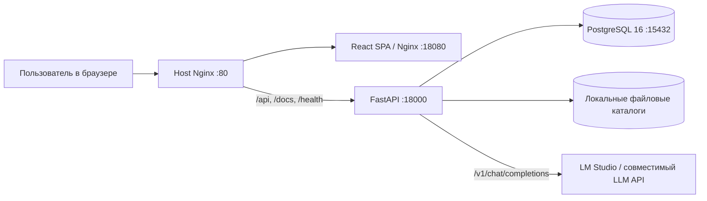

# EQM — архитектура системы (as built)

- Версия документа: **1.0**
- Дата актуализации: **17.09.2026**
- Версия проекта: **v1.1.19**
- Актуальная ревизия БД: **`0050_add_main_equipment_drive_to_technological_equipment`**

Этот документ описывает фактически реализованное состояние EQM. Источниками истины являются код приложения, SQLAlchemy-модели, цепочка Alembic и OpenAPI, формируемый FastAPI. Старые проектные примеры и нереализованные рекомендации из предыдущей редакции удалены.

## 1. Назначение и границы

EQM — on-premise веб-система для учёта оборудования автоматизации и связанных инженерных данных. Система объединяет:

- номенклатуру, производителей, категории и иерархические локации;
- склады, шкафы, сборки, экземпляры оборудования и движения остатков;
- I/O-сигналы и дерево оборудования в эксплуатации;
- технологическое оборудование и P&ID-схемы;
- IPAM, сетевые топологии и карты последовательных соединений;
- цифровые двойники электрических цепей;
- персонал, компетенции, обучения и годовые графики;
- ТОиР: инциденты, наряды, планы, наработку и показатели надёжности;
- пользователей, динамический RBAC, сессии, аудит и диагностику;
- локальный LLM-чат через совместимый с OpenAI API сервер LM Studio.

Система рассчитана на работу в локальной сети. Основной production-сценарий — автономная поставка Docker-образов, дампа PostgreSQL и постоянных файлов без доступа сервера к интернету.

## 2. Контекст и компоненты


```mermaid
flowchart LR
    U[Пользователь в браузере] --> H[Host Nginx :80]
    H --> F[React SPA / Nginx :18080]
    H -->|/api, /docs, /health| B[FastAPI :18000]
    B --> P[(PostgreSQL 16 :15432)]
    B --> FS[(Локальные файловые каталоги)]
    B -->|/v1/chat/completions| L[LM Studio / совместимый LLM API]
```

Логические слои:

1. **Presentation** — React SPA, маршрутизация, таблицы, формы, редакторы схем и локализация.
2. **Application/API** — FastAPI routers, зависимости авторизации, Pydantic DTO и прикладные сервисы.
3. **Persistence** — SQLAlchemy 2.x, PostgreSQL 16, Alembic и JSONB-документы.
4. **File storage** — фотографии, datasheet-файлы, вложения шкафов и P&ID-ресурсы.
5. **Operations** — health-check, диагностика, аудит, резервная копия и offline deploy bundle.

## 3. Технологический стек

### 3.1. Backend

- Python 3.12;
- FastAPI и Uvicorn;
- SQLAlchemy 2.x и psycopg2;
- Alembic;
- Pydantic 2 и pydantic-settings;
- PyJWT, Passlib и bcrypt;
- httpx для LLM-прокси;
- openpyxl для табличного импорта/экспорта;
- pytest и httpx для тестов.

Зависимости backend задаются нижними границами в `backend/requirements.txt`; воспроизводимость production обеспечивается заранее собранным Docker-образом.

### 3.2. Frontend

- React 18.3.1;
- TypeScript 5.9.3;
- Vite 7.3.5;
- Material UI 5.18.0 и Emotion;
- TanStack Query 5 и TanStack Table 8;
- React Router 6;
- React Flow 11 для инженерных графов;
- Recharts 2;
- i18next/react-i18next;
- Vitest и Testing Library.

Точные версии frontend зафиксированы в `frontend/package-lock.json`.

### 3.3. Runtime и инфраструктура

- PostgreSQL 16;
- Nginx 1.24 Alpine для SPA-контейнера;
- Docker Compose для production runtime;
- отдельный host Nginx как единая точка входа;
- PowerShell-сценарии для локальной разработки и сборки offline bundle.

## 4. Функциональные пространства

Доступ в UI и API группируется по пространствам `SpaceKey`.

| Пространство | Основные функции |
| --- | --- |
| `overview` | Дашборд, агрегаты, последние действия и логины |
| `personnel` | Карточки персонала, компетенции, обучения, вложения, годовой график |
| `equipment` | Номенклатура, технологическое оборудование, складские и шкафные позиции, движения |
| `cabinets` | Шкафы, сборки, состав, фото, datasheet и файлы |
| `engineering` | P&ID, I/O, IPAM, DCL, serial map, network map, digital twin |
| `maintenance` | Инциденты, наряды, планы, наработка и надёжность |
| `dictionaries` | Склады и иерархические справочники |
| `admin_users` | Пользователи, роли и матрица прав |
| `admin_sessions` | Активные и завершённые сессии |
| `admin_audit` | Журнал аудита |
| `admin_diagnostics` | Диагностика процессов, портов и журналов |

Системные роли `admin`, `engineer`, `viewer` создаются при инициализации. Каталог ролей расширяем: дополнительные роли хранятся в `role_definitions`, а права — в `role_space_permissions`.

## 5. Backend

### 5.1. Структура

```text
backend/
├─ alembic/versions/       # миграции БД
├─ app/
│  ├─ core/                # конфигурация, безопасность, RBAC, аудит, файлы
│  ├─ db/                  # engine, session, bootstrap, declarative base
│  ├─ models/              # SQLAlchemy-модели
│  ├─ routers/             # HTTP API
│  ├─ schemas/             # Pydantic DTO
│  ├─ services/            # прикладная логика
│  ├─ reference_data/      # исходные иерархические справочники
│  └─ pid_storage/         # JSON-схемы и изображения P&ID
├─ scripts/                # создание БД, seed, deploy metadata
├─ storage/                # файлы шкафов
├─ tests/                  # pytest
└─ uploads/                # общие загруженные файлы
```

`app/main.py` создаёт одно FastAPI-приложение, подключает CORS, регистрирует routers под `/api/v1` и публикует P&ID-изображения через `StaticFiles`.

### 5.2. API

Базовый путь прикладного API — `/api/v1`. Служебные endpoints:

- `GET /` — минимальная проверка доступности;
- `GET /health` — статус и версия приложения;
- `GET /docs` — Swagger UI;
- `GET /openapi.json` — контракт API.

На момент актуализации OpenAPI содержит 241 path и 367 HTTP-операций. Контракт OpenAPI является источником истины для точного набора параметров и DTO.

Основные группы endpoints:

- `/auth`, `/users`, `/sessions`, `/audit-logs`, `/admin/role-permissions`, `/admin/diagnostics`;
- `/manufacturers`, `/locations`, `/equipment-categories`, `/equipment-types`;
- `/warehouses`, `/warehouse-items`, `/cabinets`, `/cabinet-items`, `/assemblies`, `/assembly-items`, `/movements`;
- `/main-equipment`, `/technological-equipment`, `/equipment-in-operation`, `/io-signals`, `/io-tree`;
- `/pid`, `/ipam`, `/network-topologies`, `/serial-map-documents`, `/digital-twins`;
- `/personnel` и `/maintenance/*`;
- `/dashboard` и `/chat`.

Для справочников и основных реестров реализованы CRUD, soft delete/restore, серверная пагинация, поиск, сортировка и фильтрация. Многие сущности поддерживают XLSX import/export и выдачу шаблона.

Исторический alias `/api/v1/equipment_categories` сохранён вместе с каноническим `/api/v1/equipment-categories` для обратной совместимости.

### 5.3. Транзакции и конкурентные изменения

- SQLAlchemy Session создаётся на запрос; `pool_pre_ping=True` проверяет соединения из пула.
- Изменения бизнес-сущностей выполняются в транзакциях PostgreSQL.
- `VersionMixin` добавляет `row_version`; обработчик `before_flush` увеличивает версию изменённого объекта.
- Складские движения изменяют остатки и добавляют запись `equipment_movements` в одной транзакции.
- Ограничения и уникальные индексы дублируют критические инварианты на уровне БД.

## 6. Аутентификация, авторизация и безопасность

### 6.1. Аутентификация

- `POST /api/v1/auth/login` принимает JSON с логином и паролем.
- Пароли хранятся как bcrypt-хеши.
- Backend выпускает JWT с `user_id`, ролью, `session_id` и сроком действия.
- В БД хранится только SHA-256-хеш токена сессии.
- Каждый защищённый запрос проверяет JWT, пользователя и незавершённую запись `user_sessions`.
- `heartbeat` обновляет `last_seen_at`; `logout` закрывает сессию.
- Frontend хранит bearer token в `localStorage` под ключом `eqm_token`.

### 6.2. RBAC

Права задаются тройкой `can_read`, `can_write`, `can_admin` для пары роль/пространство. Нормализация гарантирует, что write/admin подразумевают read. Проверки выполняются:

- на backend через зависимости `require_space_access`, `require_read_access`, `require_write_access`, `require_admin`;
- на frontend через `RequireSpace`, фильтрацию меню и permission helpers.

Frontend-проверки улучшают UX, но не считаются границей безопасности; окончательное решение всегда принимает backend.

### 6.3. Production-ограничения конфигурации

При `ENV=production` приложение отказывается запускаться с:

- пустым или стандартным `JWT_SECRET` либо секретом короче 32 символов;
- стандартными паролями БД и seed-администратора;
- LLM endpoint вне loopback/private network и вне `LLM_ALLOWED_HOSTS`.

CORS задаётся явным списком `CORS_ORIGINS`. SQL-инъекции ограничиваются параметризованными запросами SQLAlchemy. Upload API проверяет расширение, MIME и размер файлов.

### 6.4. LLM-интеграция

`/api/v1/chat` доступен читающим пользователям, `/api/v1/chat/admin` — только администраторам. Backend:

- не принимает клиентский `output_schema`;
- добавляет фиксированный системный prompt;
- передаёт только сообщения пользователя;
- ограничивает timeout и возвращает 502 при недоступности LLM;
- запрещает произвольный внешний LLM-host в production.

LLM не является обязательным для основного функционала EQM.

## 7. Модель данных

SQLAlchemy metadata содержит 51 таблицу. Общие mixin:

- `TimestampMixin`: `created_at`, `updated_at`;
- `SoftDeleteMixin`: `is_deleted`, `deleted_at`, `deleted_by_id`;
- `VersionMixin`: `row_version`.

### 7.1. Пользователи и контроль доступа

- `users`, `user_sessions`, `audit_logs`;
- `role_definitions`, `access_spaces`, `role_space_permissions`;
- `attachments`.

### 7.2. Справочники и структура объекта

- `manufacturers`, `equipment_categories`, `locations` — иерархические справочники;
- `main_equipment` — иерархия основного оборудования;
- `technological_equipment` — технологические объекты с основным механизмом, приводом, тегом и локацией;
- `measurement_units`, `signal_types`, `data_types`;
- `equipment_types` — номенклатура с I/O-, network-, serial- и power-атрибутами.

Legacy-таблица `field_equipments` удалена миграцией 0049. Привязка полевого оборудования в актуальной модели выполняется через категорию оборудования.

### 7.3. Учёт оборудования

- `warehouses`, `warehouse_items`;
- `cabinets`, `cabinet_items`, `cabinet_files`;
- `assemblies`, `assembly_items`;
- `equipment_movements`.

Поддерживаемые движения: `inbound`, `transfer`, `to_cabinet`, `from_cabinet`, `direct_to_cabinet`, `to_assembly`, `direct_to_assembly`, `to_warehouse`, `writeoff`, `adjustment`.

### 7.4. Инженерные данные

- `io_signals` — каналы, адреса ПЛК, типы данных/сигнала, категория, диапазоны и единицы измерения;
- `pid_processes`; содержимое P&ID хранится в JSON-файлах в `PID_STORAGE_ROOT`;
- `network_topology_documents`, `serial_map_documents`, `digital_twin_documents` — версионируемые JSONB-документы;
- `vlans`, `subnets`, `equipment_network_interfaces`, `ip_addresses`, `ip_address_audit_logs` — IPAM.

### 7.5. Персонал

- `personnel`, `personnel_competencies`, `personnel_trainings`;
- `personnel_schedule_templates`;
- `personnel_yearly_schedule_assignments`, `personnel_yearly_schedule_events`.

Карточка персонала может быть связана с пользователем EQM, но пользователь и сотрудник остаются разными сущностями.

### 7.6. ТОиР

- справочники: `mnt_failure_modes`, `mnt_failure_mechanisms`, `mnt_failure_causes`, `mnt_detection_methods`, `mnt_activity_types`;
- события и работы: `mnt_incidents`, `mnt_incident_components`, `mnt_work_orders`, `mnt_work_order_items`;
- планирование и аналитика: `mnt_plans`, `mnt_operating_time`.

Актуальную физическую схему следует получать из SQLAlchemy metadata и Alembic. `docs/EQM_DB_ERD.md` остаётся обзорной схемой и требует синхронизации после изменений моделей; на дату этого документа в нём ещё присутствует удалённая таблица `field_equipments` и отсутствует часть ТОиР/технологического оборудования.

## 8. Ключевые бизнес-процессы

### 8.1. Движение оборудования

Клиент отправляет одиночную или пакетную операцию в `/api/v1/movements`. Backend валидирует обязательные источник/назначение, блокирует отрицательный остаток, обновляет агрегированные позиции склада/шкафа/сборки и пишет неизменяемую запись движения с исполнителем.

Прямое добавление в шкаф или сборку не требует складского источника. Удаление учётной позиции не должно подменять движение: история количества сохраняется в журнале операций.

### 8.2. I/O

I/O строится вокруг уникальных экземпляров оборудования в эксплуатации. API предоставляет плоский список, дерево, import/export и rebuild. Сигнал связан с каналом, типом данных, типом сигнала, категорией оборудования и единицей измерения.

### 8.3. IPAM

IPAM управляет VLAN, подсетями, вычислением адресного пространства, резервированием/назначением/освобождением IP и сетевыми интерфейсами оборудования. Каждое изменение IP фиксируется в отдельном журнале `ip_address_audit_logs`.

### 8.4. Инженерные редакторы

P&ID сохраняет описание процесса в файловом JSON-хранилище. Network map, serial map и digital twin используют JSONB-документы в PostgreSQL, поддерживают привязку к локации/источнику, дублирование и optimistic versioning.

### 8.5. ТОиР

Инцидент может включать затронутые компоненты и классификацию отказа. Наряд связывается с инцидентом или планом и содержит состав работ. Наработка используется для сводок надёжности, трендов отказов и рейтинга причин.

## 9. Frontend

### 9.1. Структура приложения

```text
frontend/src/
├─ api/             # HTTP-клиенты и контракты
├─ components/      # общие компоненты и UI primitives
├─ context/         # AuthContext и ThemeContext
├─ features/        # IPAM, P&ID, network map, serial map, digital twin, schedule
├─ i18n/            # ru/en ресурсы
├─ navigation/      # единая модель меню
├─ pages/           # route-level страницы
├─ utils/           # форматирование и helpers
├─ App.tsx          # lazy routes и guards
└─ main.tsx         # bootstrap React
```

Route-level страницы загружаются через `React.lazy`/`Suspense`. TanStack Query управляет серверным состоянием. Авторизация и вычисленные права доступны через `AuthContext`; тема — через `ThemeContext`.

### 9.2. Навигация

Основные route-группы:

- `/dashboard`;
- `/personnel/*`;
- `/equipment/*`, `/warehouse-items`, `/cabinet-items`, `/movements`;
- `/cabinets/*`, `/assemblies/*`;
- `/engineering/*`, `/io-signals`, `/ipam`;
- `/maintenance/*`;
- `/dictionaries/*`, `/warehouses`;
- `/admin/*`;
- `/help`.

Модель меню и route guards используют одинаковые ключи пространств, что снижает риск показа недоступных разделов.

### 9.3. API base URL

В development frontend использует `VITE_API_URL`, а при его отсутствии — `http://localhost:8000/api/v1`. Production-сборка использует `/api/v1`, который host Nginx проксирует в backend.

## 10. Файловое хранение

Файлы не сохраняются в PostgreSQL; БД содержит метаданные и имена.

| Категория | Настройка/каталог | Ограничения |
| --- | --- | --- |
| Фото номенклатуры/шкафов | `PHOTO_DIR` | JPEG/PNG/WebP, до 2 MB |
| Datasheet | `DATASHEET_DIR` | PDF/XLSX/DOC/DOCX, до 5 MB |
| Файлы шкафов | `CABINET_FILES_DIR` | лимит `CABINET_FILES_MAX_SIZE`, production default 10 GB |
| Общие вложения | `UPLOAD_DIR` | метаданные в `attachments` |
| P&ID | `PID_STORAGE_ROOT` | diagrams JSON и images |

Production-каталоги монтируются в контейнер backend как bind volumes и должны входить в резервное копирование.

## 11. Конфигурация

Backend читает `backend/.env`; production Compose использует `deploy/app/.env`. Основные группы переменных:

- БД: `DB_HOST`, `DB_PORT`, `DB_NAME`, `DB_USER`, `DB_PASSWORD`;
- security: `ENV`, `JWT_SECRET`, `JWT_ALGORITHM`, `JWT_EXPIRE_MINUTES`, `CORS_ORIGINS`;
- URL/runtime: `PUBLIC_BASE_URL`, `FRONTEND_*`, `BACKEND_*`;
- storage: `PHOTO_DIR`, `DATASHEET_DIR`, `UPLOAD_DIR`, `CABINET_FILES_DIR`, `PID_STORAGE_ROOT`;
- LLM: `LM_STUDIO_BASE_URL`, `LM_STUDIO_API_KEY`, `LM_MODEL`, `LLM_ALLOWED_HOSTS`;
- bootstrap: `SEED_ADMIN_USERNAME`, `SEED_ADMIN_PASSWORD`, `ALLOW_ADMIN_PASSWORD_RESET`.

Секреты не должны попадать в Git. В репозитории хранятся только `.env.example` с placeholder-значениями.

## 12. Миграции и bootstrap

Схема развивается через Alembic. Текущий head — `0050_add_main_equipment_drive_to_technological_equipment`; в каталоге миграций находятся 51 файл, включая merge revision для исторического разветвления.

Production backend запускается в последовательности:

1. `python -m app.db.bootstrap` — гарантирует служебную таблицу Alembic;
2. `alembic upgrade head`;
3. повторный bootstrap — создаёт/восстанавливает seed-администратора;
4. `uvicorn app.main:app --host 0.0.0.0 --port 8000`.

Скрипт `backend/scripts/seed.py` заполняет базовые справочники, роли и демонстрационные/начальные данные. Текущий bootstrap синхронизирует роль и пароль seed-администратора со значениями окружения при каждом запуске, поэтому production-значение `SEED_ADMIN_PASSWORD` является постоянным секретом эксплуатации.

## 13. Развёртывание

### 13.1. Локальная разработка

Штатная схема:

```text
Browser -> Vite :5173 -> FastAPI :8000 -> PostgreSQL :5432
```

Команды `start-local.ps1` и `stop-local.ps1` работают с локальным кластером `.postgres/data`. Порты можно переопределить переменными окружения и `VITE_API_URL`, если стандартные заняты.

### 13.2. Production/offline

Docker Compose поднимает три контейнера в сети `eqm`:

| Сервис | Внутренний порт | Loopback-порт хоста по умолчанию |
| --- | ---: | ---: |
| PostgreSQL | 5432 | 15432 |
| FastAPI | 8000 | 18000 |
| Frontend Nginx | 80 | 18080 |

Host Nginx принимает запросы на порту 80, проксирует `/api`, `/docs`, `/openapi.json`, `/health` в backend, остальные запросы — во frontend. Контейнерные порты не публикуются во внешнюю сеть напрямую.

Offline bundle собирается `deploy/build-offline-bundle.ps1` и должен содержать:

- исходники и production-конфигурацию;
- frontend build;
- backend/frontend/PostgreSQL Docker images;
- свежий SQL dump и отчёты состава БД;
- постоянные файлы и эксплуатационную документацию.

Известное несоответствие на дату актуализации: `deploy/build-offline-bundle.ps1` всё ещё проверяет ожидаемую ревизию `0043_add_io_signal_plc_range_fields`, тогда как текущий head — 0050. До следующей успешной сборки bundle проверку необходимо синхронизировать с head.

## 14. Наблюдаемость и эксплуатация

- `/health` используется Docker health-check и внешней проверкой;
- backend, frontend и PostgreSQL пишут раздельные runtime logs;
- аудит фиксирует пользователя, действие, сущность, значения до/после и metadata;
- журнал сессий хранит IP, User-Agent, начало, heartbeat, завершение и причину;
- административная диагностика показывает runtime summary, процессы, порты и журналы и защищена admin-space;
- retention для сессий и аудита ограничивает рост служебных таблиц;
- дамп PostgreSQL и bind-mounted storage должны резервироваться согласованно.

## 15. Тестирование и контроль качества

Backend-тесты покрывают health/version, авторизацию и online-сессии, RBAC, диагностику, движения, уникальность экземпляров, файлы, I/O, IPAM, P&ID, цифровые двойники, персонал и security configuration.

Frontend-тесты покрывают API helpers, обработку ошибок, чат, P&ID symbols/state, photo compression и отдельные интерактивные компоненты. Дополнительно выполняются:

- `npm run build` — TypeScript + production bundle;
- `npm run test` — Vitest;
- `npm run audit:i18n` — поиск жёстко заданных UI-строк;
- `pytest` — backend suite;
- smoke-check `/health`, `/docs`, frontend и login flow;
- freshness-check deploy bundle перед выпуском.

## 16. Версионирование и источники истины

- версия продукта хранится в корневом `VERSION` и встраивается в backend/frontend;
- любая итерация изменений повышает BUILD через `python tools/bump_version.py`;
- схема БД определяется SQLAlchemy-моделями и Alembic;
- HTTP-контракт определяется `/openapi.json`;
- frontend navigation определяется `frontend/src/navigation/nav.ts`;
- production topology определяется `deploy/app/docker-compose.yml` и Nginx-конфигурациями;
- deploy bundle после изменений должен быть пересобран и проверен `tools/check-deploy-bundle-freshness.ps1`.

## 17. Ограничения текущей реализации

- приложение развёртывается как один backend monolith и одна SPA; горизонтальное масштабирование и внешнее объектное хранилище не настроены;
- bearer token хранится в `localStorage`, поэтому защита frontend от XSS критична;
- backend dependencies не закреплены lock-файлом, воспроизводимость зависит от Docker-образа;
- P&ID использует файловое JSON-хранилище, тогда как остальные редакторы — JSONB в PostgreSQL;
- полнотекстовый поиск реализован как прикладной поиск по полям, а не как отдельный поисковый движок;
- TLS завершается внешней инфраструктурой/host Nginx; контейнеры сами HTTPS не предоставляют;
- `docs/EQM_DB_ERD.md` и expected revision в bundle builder требуют отдельной синхронизации с head 0050.

## 18. Критерии архитектурной целостности

Изменение считается согласованным с архитектурой, если:

1. модель, миграция, schema и API изменены совместно;
2. backend проверяет доступ независимо от frontend;
3. изменение количества оборудования проходит через транзакционный movement flow;
4. новые пользовательские строки добавлены в ru/en локализации;
5. новые страницы зарегистрированы в routes и navigation с корректным `SpaceKey`;
6. новые файлы имеют явные ограничения и постоянный storage path;
7. добавлены тесты пропорционально риску;
8. повышена версия проекта;
9. пересобран и проверен offline deploy bundle.
