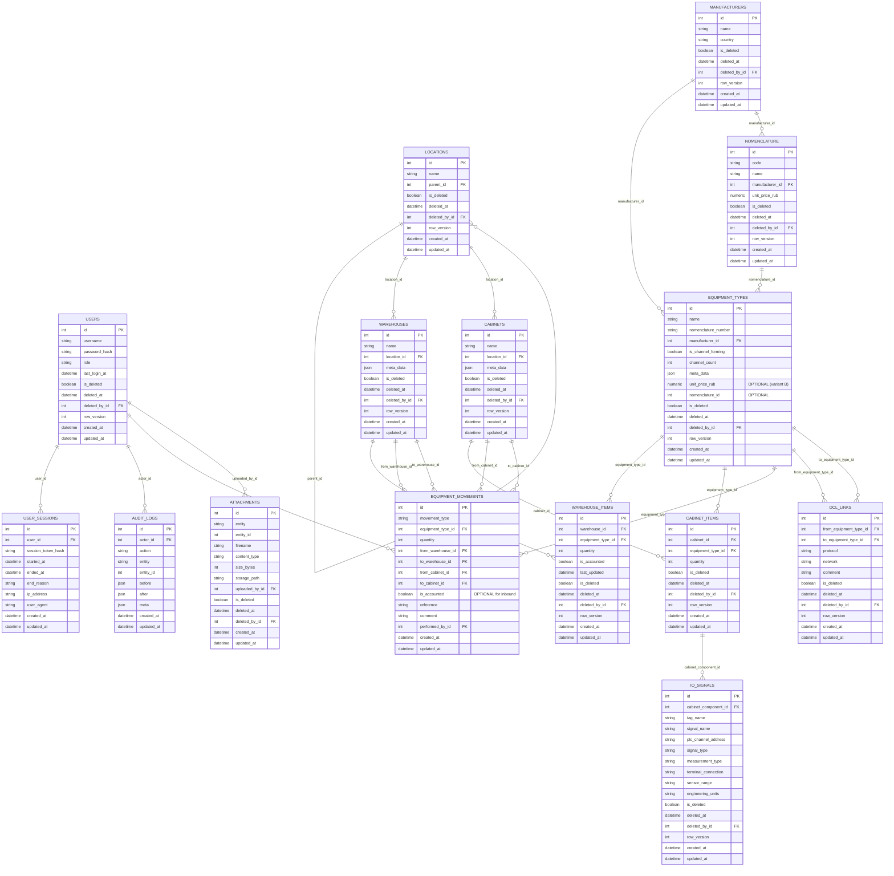

# EQM Change Plan (Menu + Dashboards + Tables) — v1

Основание: требования и Mermaid/структура из `eqmchangeplan.docx`. fileciteturn5file0

## 0) Что меняем (коротко)

### 0.1. Новая структура меню (вложенность)
Цель — привести UI к логике:

- **Overview** (дашборды)
- **Оборудование**
  - Складские позиции (Warehouse Items) + упрощённые “перемещения” прямо на странице
- **Шкафы**
  - Шкафные позиции (Cabinets list) → переход в **Состав шкафа** (пока пустая страница-заглушка)
- **Engineering**
  - IO Signals
  - DCL (новая таблица/экран; backend может быть заглушкой на первом этапе)
- **Dictionaries**
  - Warehouses
  - Cabinets
  - Manufacturers
  - Nomenclature (новый справочник; нужен в БД)
  - Locations (иерархия)
- **Admin** (не трогаем)
  - Users
  - Sessions
  - Audit Logs

fileciteturn5file0

### 0.2. Overview: меняем состав дашбордов
**Верхняя строка (cards):**
1) **Всего шкафов** = `count(cabinets)`  
2) **Всего ПЛК в шкафах** = сумма `cabinet_items.quantity` по типам, где `equipment_types.is_channel_forming=true`  
3) **Всего ПЛК на складах** = сумма `warehouse_items.quantity` по типам, где `equipment_types.is_channel_forming=true`  
4) **Всего каналов** = сумма по шкафам: `cabinet_items.quantity * equipment_types.channel_count` для `is_channel_forming=true`  
5) **Всего оборудования на сумму** = сумма по складам: `warehouse_items.quantity * unit_price_rub`

**Средняя строка (donut charts):**
1) **Распределение по типам**: суммарно по всем складам, группировка по `equipment_types.name`, значение = `sum(warehouse_items.quantity)`  
2) **Остатки по складам**: группировка по `warehouses.name`, значение = `sum(warehouse_items.quantity)` (в tooltip добавляем “единиц”)  
3) **Учтено/Не учтено**: группировка по `warehouse_items.is_accounted` (новый bool) для входящих движений “На склад”  
4) **Стоимость по складам**: donut по складам (не по типам), значение = `sum(warehouse_items.quantity * unit_price_rub)`

**Нижняя строка:** “Последние действия” (audit) и “Последние логины” (sessions) — оставить.

fileciteturn5file0

---

## 1) Серые зоны / вопросы (ответьте, чтобы не ошибиться)

1) **Nomenclature**:  
   - Это отдельная сущность справочника (как “позиция номенклатуры”) или это просто поле `equipment_types.nomenclature_number`?  
   - Если отдельная таблица нужна: какие поля? (минимум: `code`, `name`, `manufacturer_id?`, `unit_price_rub?`, `meta_data?`).

2) **unit_price_rub**: сейчас предполагается в `equipment_types.meta_data.unit_price_rub`.  
   - Хотите вынести в отдельную колонку `equipment_types.unit_price_rub NUMERIC`? Это упростит агрегации и индексы.

3) **“Учтено/Не учтено”**: вы пишете, что статус выставляется флажком **в warehouse-items при движении “На склад”**.  
   - Нужно ли хранить это как поле **в warehouse_items** (текущее состояние позиции) или в **movements** (событие) и затем агрегировать?  
   - Рекомендация: `warehouse_items.is_accounted` (текущее состояние) + `movements.is_accounted` (опционально, как источник).

4) **DCL**: пока нет структуры таблицы.  
   - Минимальный набор полей (предложение ниже) ок?

Если не ответить сейчас — сделаем “разумные дефолты” в Change Plan и пометим как TODO.

---

## 2) Обновлённая структура БД (предложение)

Ниже — минимальные изменения к текущей схеме, чтобы закрыть ваши изменения UI и дашбордов.  
Все изменения — через Alembic миграции (0004+), без правки старых миграций.

### 2.1. Изменения существующих таблиц

#### `warehouse_items`
Добавить:
- `is_accounted BOOLEAN NOT NULL DEFAULT true` — для donut “Учтено/Не учтено”

Индекс:
- (частичный) `WHERE is_deleted=false` для фильтров/списков (если ещё нет).

#### `equipment_types`
Рекомендуется (вариант A — оставить как есть):
- `meta_data` уже JSONB; хранить `unit_price_rub` там.

Рекомендуется (вариант B — лучше для аналитики):
- добавить колонку `unit_price_rub NUMERIC(14,2) NULL` и валидацию >=0.
- опционально синхронизировать (при seed/CRUD) в `meta_data` или наоборот.

### 2.2. Новые таблицы

#### `nomenclature` (если нужен отдельный справочник)
Минимум:
- `id PK`
- `code TEXT UNIQUE NOT NULL`
- `name TEXT NOT NULL`
- `manufacturer_id FK NULL`
- `unit_price_rub NUMERIC(14,2) NULL`
- soft-delete поля как в остальных справочниках

Связь:
- `equipment_types.nomenclature_id FK NULL` (опционально)  
  либо “Nomenclature” полностью заменяет `nomenclature_number`.

#### `dcl_links` (Engineering → DCL)
Заготовка структуры (можно расширять):
- `id PK`
- `from_equipment_type_id FK` (PLC)
- `to_equipment_type_id FK` (HMI/PLC/другое)
- `protocol TEXT` (Modbus, Profinet, OPC UA…)
- `network TEXT` (VLAN/segment/whatever)
- `comment TEXT`
- soft-delete + audit

> Если вы хотите привязку к конкретным шкафам (реальные устройства в шкафе), то вместо `equipment_type_id` нужна привязка к **экземпляру** (например, `cabinet_items.id`), но это уже усложнение “v2”.

---

## 3) Mermaid ER (обновлённый)



---

## 4) Новая структура меню (визуально)

```
Sidebar
├─ Overview
├─ Оборудование
│  └─ Складские позиции
├─ Шкафы
│  ├─ Шкафные позиции
│  └─ Состав шкафа (route: /cabinets/:id/composition) [пока заглушка]
├─ Engineering
│  ├─ IO Signals
│  └─ DCL
├─ Dictionaries
│  ├─ Warehouses
│  ├─ Cabinets
│  ├─ Manufacturers
│  ├─ Nomenclature
│  └─ Locations
└─ Admin
   ├─ Users
   ├─ Sessions
   └─ Audit Logs
```

Принцип: “таблицы-справочники” живут в Dictionaries, а “операционные” — в Equipment/Cabinets/Engineering.

fileciteturn5file0

---

## 5) Пошаговый план внедрения (Change Plan)

Ниже — безопасная последовательность, чтобы “ничего не упало”, и вы могли часто менять схему.

### Шаг A — только Frontend: новая навигация и страницы (без изменения API)
**Цель:** пользователь видит правильное меню и может открыть нужные страницы.  
**Backend:** не трогаем; если endpoint нет — ставим заглушки в UI (плашка “Coming soon”).

Acceptance:
- Sidebar соответствует структуре из раздела 4.
- Routes не падают, приложение не белеет, нет infinite redirects.
- “Состав шкафа” открывается по клику из таблицы шкафов (хотя бы пустая).

Prompt для Codex (A):
- См. раздел 6.

### Шаг B — Dashboard (Frontend) + контракт на данные
**Цель:** перерисовать Overview под новые метрики и donut’ы.  
**Backend:** если API уже есть (dashboard router) — корректируем; если нет — временная заглушка JSON в `frontend/src/api`.

Acceptance:
- 5 верхних карточек и 4 donut’а отображаются и не падают.
- Tooltip “единиц” у “Остатки по складам”.
- Ошибка отсутствия данных отображается как “Нет данных” (не crash).

### Шаг C — Warehouse Items: CRUD + 2 действия движения прямо со страницы
**Цель:** страницу “Складские позиции” сделать главной операционной страницей склада.  
Нужно:
- Полный CRUD
- Copy/Paste (на уровне UI)
- Действия: “На склад”, “Со склада в шкаф” (переиспользовать Movements UI/форму)
- Фильтрация/поиск/сортировка исправить (единая логика query params)

Acceptance:
- Создание/редактирование/удаление позиции работает.
- “На склад” увеличивает quantity (или создаёт запись) и пишет movement.
- “Со склада в шкаф” уменьшает склад, увеличивает шкаф и пишет movement.
- Если остатка не хватает — UI показывает ошибку (и backend возвращает 400/409).

### Шаг D — DB изменения (backend) под Overview + учтено/не учтено + Nomenclature/DCL (опционально)
**Цель:** подготовить backend к новым дашбордам и новым разделам.  
Только после того, как UI-скелет согласован.

Acceptance:
- Alembic upgrade head проходит (0004+)
- Seed идемпотентен и заполняет минимум сущностей
- Dashboard endpoints возвращают новые агрегаты

---

## 6) Промпты для Codex (максимально безопасные)

### PROMPT-A (Frontend nav + routes, без backend)
**Вставьте в Codex:**
> Ты работаешь в репозитории EQM. Задача: переделать структуру меню и роутинг строго по Change Plan (см. changeplan.md). Backend НЕ ТРОГАТЬ.  
> 1) Обнови `AppLayout.tsx` (navItems) и `App.tsx` (routes) так, чтобы sidebar был: Overview; Оборудование/Складские позиции; Шкафы/Шкафные позиции; Engineering/IO Signals + DCL; Dictionaries (Warehouses, Cabinets, Manufacturers, Nomenclature, Locations); Admin (Users, Sessions, Audit Logs).  
> 2) Реализуй страницу-заглушку `CabinetCompositionPage.tsx` и роут `/cabinets/:id/composition`.  
> 3) В таблице шкафов добавь действие “Открыть состав” → переход на роут.  
> 4) Если каких-то страниц нет — создай минимальные страницы со стандартным DataTable и заголовком, без API логики.  
> 5) Все файлы сохраняй UTF-8, не допускай `?????` в строках.  
> Acceptance: приложение собирается, меню отображается корректно, переходы работают.

### PROMPT-B (Overview dashboards, допускаются заглушки)
> Backend НЕ ТРОГАТЬ. Обнови `DashboardPage.tsx`: верхняя строка 5 карточек и 4 donut chart согласно changeplan.md.  
> Если backend не отдаёт нужных данных — реализуй временный слой `frontend/src/api/dashboard.ts` с мок-ответами и TODO комментариями, какие поля нужны от backend.  
> Acceptance: Overview отображается без ошибок, tooltip “единиц” есть, при отсутствии данных показывается “Нет данных”.

### PROMPT-C (Warehouse Items page: добавить “движения”)
> Backend НЕ ТРОГАТЬ. На странице WarehouseItems добавь UI-действия:  
> - “На склад” (форма: equipment_type, warehouse, qty, is_accounted checkbox, comment)  
> - “Со склада в шкаф” (форма: equipment_type, from_warehouse, to_cabinet, qty, comment)  
> Формы могут дергать существующий movements endpoint; если его нет/не совпадает — делай временные заглушки и показывай пользователю “Not implemented”.  
> Acceptance: UI работает, валидации на пустые поля есть, ошибки показываются через snackbar.

### PROMPT-D (Backend schema change через Alembic) — запускать позже
> Прочитай changeplan.md. Добавь `warehouse_items.is_accounted` и (если согласовано) новые таблицы nomenclature и dcl_links.  
> Не переписывай старые миграции. Создай новую Alembic 0004+. Обнови модели и schemas. Обнови seed (идемпотентно).  
> Acceptance: alembic upgrade head проходит; Swagger отображает новые поля; dashboard endpoints готовы.

---

## 7) Что точно потребует backend (не сделать “чисто фронтом”)

1) Новые агрегаты для Overview (если не хотим мокать):
- totals для карточек
- series для donut’ов “по типам/по складам/учтено/стоимость”

2) `warehouse_items.is_accounted` (для donut “Учтено/Не учтено” без сложной агрегации по movements)

3) Если вводим Nomenclature как отдельную сущность — нужны CRUD endpoints + связи

4) DCL — нужен backend контракт или временный mock

---

## 8) Команды проверки после каждого шага

### Frontend
```powershell
cd D:\Projects\WEB\EQM\frontend
npm install
npm run dev
```

### Backend
```powershell
cd D:\Projects\WEB\EQM
.\.venv\Scripts\Activate.ps1
cd backend
uvicorn app.main:app --reload
```

---

## 9) Примечание по безопасным изменениям с Codex

Правило “безболезненности”:
1) Сначала **UI-структура/маршруты** (без изменения API)  
2) Потом **контракты данных** (DTO) и заглушки  
3) Потом **миграции БД** (Alembic)  
4) Потом **backend endpoints**  
5) Потом **синхронизация UI ↔ backend**

Так вы всегда видите прогресс и не “ломаете проект” глобальной правкой сразу.
