# EQM Database ERD

Актуальная `mermaid`-схема БД EQM, собранная по SQLAlchemy-моделям из `backend/app/models`.

Примечания:
- Диаграмма включает все основные таблицы и явные бизнес-FK.
- Повторяющийся служебный FK `deleted_by_id -> users.id` у всех таблиц с `SoftDeleteMixin` намеренно не прорисован отдельно, чтобы схема оставалась читаемой.

```mermaid
erDiagram
    role_definitions {
        string key PK
        string label
        boolean is_system
    }

    access_spaces {
        string key PK
        string label
        boolean is_admin_space
    }

    role_space_permissions {
        int id PK
        string role FK
        string space_key FK
        boolean can_read
        boolean can_write
        boolean can_admin
    }

    users {
        int id PK
        string username
        string password_hash
        string role FK
        datetime last_login_at
        boolean is_deleted
        int row_version
    }

    user_sessions {
        int id PK
        int user_id FK
        string session_token_hash
        datetime started_at
        datetime ended_at
        string end_reason
    }

    audit_logs {
        int id PK
        int actor_id FK
        string action
        string entity
        int entity_id
        jsonb before
        jsonb after
        jsonb meta
    }

    attachments {
        int id PK
        string entity
        int entity_id
        string filename
        string content_type
        int size_bytes
        string storage_path
        int uploaded_by_id FK
        boolean is_deleted
    }

    manufacturers {
        int id PK
        string name
        string country
        int parent_id FK
        string website
        boolean is_deleted
        int row_version
    }

    equipment_categories {
        int id PK
        string name
        int parent_id FK
        boolean is_deleted
        int row_version
    }

    locations {
        int id PK
        string name
        int parent_id FK
        boolean is_deleted
        int row_version
    }

    main_equipment {
        int id PK
        string name
        int parent_id FK
        int level
        string code
        jsonb meta_data
        boolean is_deleted
        int row_version
    }

    measurement_units {
        int id PK
        string name
        int parent_id FK
        int sort_order
        boolean is_deleted
        int row_version
    }

    signal_types {
        int id PK
        string name
        int parent_id FK
        int sort_order
        boolean is_deleted
        int row_version
    }

    field_equipments {
        int id PK
        string name
        int parent_id FK
        boolean is_deleted
        int row_version
    }

    data_types {
        int id PK
        string name
        int parent_id FK
        string tooltip
        boolean is_deleted
        int row_version
    }

    equipment_types {
        int id PK
        string name
        string article
        string nomenclature_number
        int manufacturer_id FK
        int equipment_category_id FK
        boolean is_channel_forming
        int channel_count
        boolean is_network
        boolean has_serial_interfaces
        jsonb meta_data
        boolean is_deleted
        int row_version
    }

    warehouses {
        int id PK
        string name
        int location_id FK
        jsonb meta_data
        boolean is_deleted
        int row_version
    }

    cabinets {
        int id PK
        string name
        string factory_number
        string nomenclature_number
        int location_id FK
        jsonb meta_data
        string photo_filename
        string photo_mime
        string datasheet_filename
        string datasheet_mime
        string datasheet_original_name
        boolean is_deleted
        int row_version
    }

    cabinet_files {
        int id PK
        int cabinet_id FK
        string original_name
        string stored_name
        string ext
        int size_bytes
        string mime
        int created_by_id FK
        boolean is_deleted
    }

    assemblies {
        int id PK
        string name
        string factory_number
        string nomenclature_number
        int location_id FK
        jsonb meta_data
        boolean is_deleted
        int row_version
    }

    warehouse_items {
        int id PK
        int warehouse_id FK
        int equipment_type_id FK
        int quantity
        boolean is_accounted
        datetime last_updated
        boolean is_deleted
        int row_version
    }

    cabinet_items {
        int id PK
        int cabinet_id FK
        int equipment_type_id FK
        int quantity
        boolean is_deleted
        int row_version
    }

    assembly_items {
        int id PK
        int assembly_id FK
        int equipment_type_id FK
        int quantity
        boolean is_deleted
        int row_version
    }

    personnel_schedule_templates {
        int id PK
        string name
        string number
        string label
        string description
        boolean is_deleted
        int row_version
    }

    personnel {
        int id PK
        int user_id FK
        int schedule_template_id FK
        string first_name
        string last_name
        string position
        string personnel_number
        string email
        boolean is_deleted
        int row_version
    }

    personnel_competencies {
        int id PK
        int personnel_id FK
        string name
        string organisation
        date completion_date
        boolean is_deleted
        int row_version
    }

    personnel_trainings {
        int id PK
        int personnel_id FK
        string name
        date completion_date
        date next_due_date
        int reminder_offset_days
        boolean is_deleted
        int row_version
    }

    personnel_yearly_schedule_assignments {
        int id PK
        int personnel_id FK
        int year
        date work_date
        string status
        boolean is_deleted
        int row_version
    }

    personnel_yearly_schedule_events {
        int id PK
        int personnel_id FK
        int year
        date work_date
        string label
        boolean is_deleted
        int row_version
    }

    io_signals {
        int id PK
        int equipment_in_operation_id FK
        string signal_type
        int channel_index
        int data_type_id FK
        int signal_kind_id FK
        int field_equipment_id FK
        int measurement_unit_id FK
        boolean is_active
        boolean is_deleted
        int row_version
    }

    equipment_movements {
        int id PK
        string movement_type
        int equipment_type_id FK
        int quantity
        int from_warehouse_id FK
        int to_warehouse_id FK
        int from_cabinet_id FK
        int to_cabinet_id FK
        int to_assembly_id FK
        int performed_by_id FK
    }

    vlans {
        int id PK
        int vlan_number
        string name
        int location_id FK
        boolean is_active
        boolean is_deleted
        int row_version
    }

    subnets {
        int id PK
        int vlan_id FK
        string cidr
        int prefix
        string network_address
        int location_id FK
        string vrf
        boolean is_active
        boolean is_deleted
        int row_version
    }

    equipment_network_interfaces {
        int id PK
        int equipment_instance_id FK
        string equipment_item_source
        int equipment_item_id
        string interface_name
        int interface_index
        string mac_address
        boolean is_management
        boolean is_active
        boolean is_deleted
        int row_version
    }

    ip_addresses {
        int id PK
        int subnet_id FK
        string ip_address
        int ip_offset
        string status
        int equipment_instance_id FK
        int equipment_interface_id FK
        boolean is_primary
        boolean is_deleted
        int row_version
    }

    ip_address_audit_logs {
        int id PK
        int ip_address_id FK
        int subnet_id FK
        string ip_address
        string action
        int actor_user_id FK
        jsonb payload_json
    }

    pid_processes {
        int id PK
        int location_id FK
        string name
        string description
        boolean is_deleted
        int row_version
    }

    network_topology_documents {
        int id PK
        string name
        string scope
        int location_id FK
        int created_by_id FK
        int updated_by_id FK
        jsonb document_json
        boolean is_deleted
        int row_version
    }

    serial_map_documents {
        int id PK
        string name
        string scope
        int location_id FK
        int created_by_id FK
        int updated_by_id FK
        jsonb document_json
        boolean is_deleted
        int row_version
    }

    digital_twin_documents {
        int id PK
        string scope
        int source_id
        int created_by_id FK
        int updated_by_id FK
        jsonb document_json
        boolean is_deleted
        int row_version
    }

    role_definitions ||--o{ users : role
    role_definitions ||--o{ role_space_permissions : role
    access_spaces ||--o{ role_space_permissions : space_key

    users ||--o{ user_sessions : user_id
    users ||--o{ audit_logs : actor_id
    users ||--o{ attachments : uploaded_by_id
    users ||--o{ cabinet_files : created_by_id
    users ||--o{ equipment_movements : performed_by_id
    users ||--o| personnel : user_id
    users ||--o{ ip_address_audit_logs : actor_user_id
    users ||--o{ network_topology_documents : created_by_id
    users ||--o{ network_topology_documents : updated_by_id
    users ||--o{ serial_map_documents : created_by_id
    users ||--o{ serial_map_documents : updated_by_id
    users ||--o{ digital_twin_documents : created_by_id
    users ||--o{ digital_twin_documents : updated_by_id

    manufacturers ||--o{ manufacturers : parent_id
    equipment_categories ||--o{ equipment_categories : parent_id
    locations ||--o{ locations : parent_id
    main_equipment ||--o{ main_equipment : parent_id
    measurement_units ||--o{ measurement_units : parent_id
    signal_types ||--o{ signal_types : parent_id
    field_equipments ||--o{ field_equipments : parent_id
    data_types ||--o{ data_types : parent_id

    manufacturers ||--o{ equipment_types : manufacturer_id
    equipment_categories ||--o{ equipment_types : equipment_category_id

    locations ||--o{ warehouses : location_id
    locations ||--o{ cabinets : location_id
    locations ||--o{ assemblies : location_id
    locations ||--o{ vlans : location_id
    locations ||--o{ subnets : location_id
    locations ||--o{ pid_processes : location_id
    locations ||--o{ network_topology_documents : location_id
    locations ||--o{ serial_map_documents : location_id

    warehouses ||--o{ warehouse_items : warehouse_id
    equipment_types ||--o{ warehouse_items : equipment_type_id

    cabinets ||--o{ cabinet_items : cabinet_id
    equipment_types ||--o{ cabinet_items : equipment_type_id

    assemblies ||--o{ assembly_items : assembly_id
    equipment_types ||--o{ assembly_items : equipment_type_id

    cabinets ||--o{ cabinet_files : cabinet_id

    personnel_schedule_templates ||--o{ personnel : schedule_template_id
    personnel ||--o{ personnel_competencies : personnel_id
    personnel ||--o{ personnel_trainings : personnel_id
    personnel ||--o{ personnel_yearly_schedule_assignments : personnel_id
    personnel ||--o{ personnel_yearly_schedule_events : personnel_id

    cabinet_items ||--o{ io_signals : equipment_in_operation_id
    data_types ||--o{ io_signals : data_type_id
    signal_types ||--o{ io_signals : signal_kind_id
    field_equipments ||--o{ io_signals : field_equipment_id
    measurement_units ||--o{ io_signals : measurement_unit_id

    vlans ||--o{ subnets : vlan_id
    subnets ||--o{ ip_addresses : subnet_id
    cabinet_items ||--o{ equipment_network_interfaces : equipment_instance_id
    cabinet_items ||--o{ ip_addresses : equipment_instance_id
    equipment_network_interfaces ||--o{ ip_addresses : equipment_interface_id
    ip_addresses ||--o{ ip_address_audit_logs : ip_address_id
    subnets ||--o{ ip_address_audit_logs : subnet_id

    equipment_types ||--o{ equipment_movements : equipment_type_id
    warehouses ||--o{ equipment_movements : from_warehouse_id
    warehouses ||--o{ equipment_movements : to_warehouse_id
    cabinets ||--o{ equipment_movements : from_cabinet_id
    cabinets ||--o{ equipment_movements : to_cabinet_id
    assemblies ||--o{ equipment_movements : to_assembly_id
```

